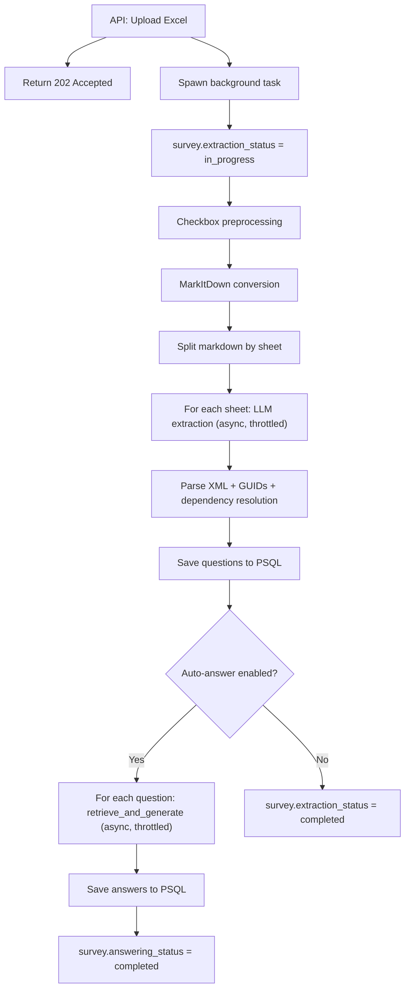
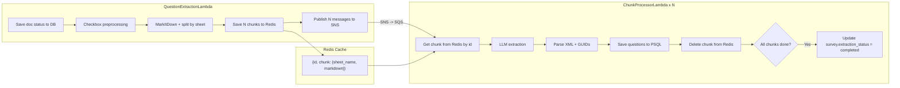
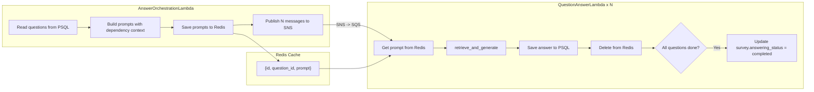
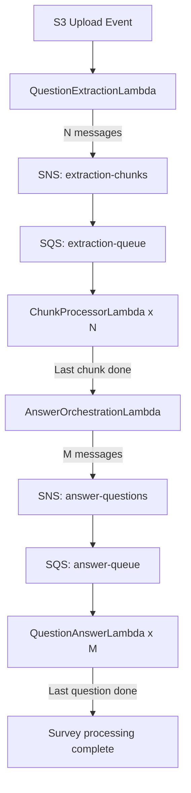
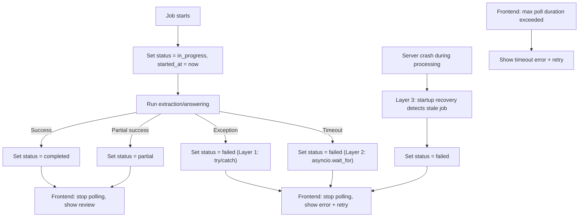

# Architecture: LLM Question Extraction + Auto-Answering

## Overview

This document describes the architecture for integrating LLM-based question extraction and automatic answer generation into the enterprise backend. The system operates as a two-phase pipeline: Phase 1 extracts questions from uploaded Excel files, Phase 2 generates AI draft answers using Bedrock Knowledge Base RAG.

Two architectural options were evaluated. Both share the same database schema, model classes, configuration, feature flags, shared components, and extraction/answering logic. They differ only in how processing is orchestrated.

---

## Option A: Backend API Background Task

All processing runs as a background task on the long-lived backend server (ECS/Fargate). The API returns immediately after upload, and the frontend polls for status until processing completes. The user sees the full review page only after both phases finish.

### How It Works



### Parallelism and Throttling

Uses `asyncio.Semaphore` to limit concurrent Bedrock calls from a single process:

```python
semaphore = asyncio.Semaphore(config.max_concurrent_llm_calls)  # e.g., 10

async def extract_sheet(sheet_content: str, sheet_name: str) -> list[ExtractedQuestion]:
    async with semaphore:
        response = await invoke_llm(sheet_content, sheet_name)
        return parse_xml_response(response, sheet_name)

# Process all sheets in parallel, max 10 concurrent
all_questions = await asyncio.gather(*[
    extract_sheet(chunk.content, chunk.sheet_name)
    for chunk in sheet_chunks
])
```

The same pattern applies to Phase 2 (answering), using a separate semaphore for RAG calls.

### Infrastructure Requirements

None beyond the existing backend server. No new AWS resources needed.

### Failure Handling

- Per-sheet failure is handled in code: if one sheet fails, the others continue, and the survey is marked `partial`
- A full server crash loses all in-progress work; recovered by the startup stale job detector (see Error Handling and Recovery)
- Standard structured logging in a single process makes debugging straightforward

### Key Characteristics

| Aspect | Detail |
|--------|--------|
| **Runtime** | Long-lived server (ECS/Fargate) |
| **Parallelism** | `asyncio.Semaphore` limits concurrent Bedrock calls |
| **Memory** | Server holds full file + all intermediate results in memory |
| **Deployment** | Code changes only, no infrastructure changes |
| **Debugging** | Single process, standard logging, direct breakpoints |
| **Cold starts** | None |
| **Cost** | Included in existing server cost |

---

## Option B: Lambda + SNS/SQS + Redis

Processing is distributed across Lambda functions coordinated by SNS/SQS message queues. Redis serves as a temporary data store for chunks. This architecture follows the same fan-out pattern for both extraction and answering phases.

### Extraction Phase



### Answering Phase

After extraction completes, a second fan-out handles auto-answering using the same pattern:



### Combined Flow (Both Phases)



### Message Flow

SNS/SQS messages carry only metadata to stay well under the 256 KB message size limit:

```json
{
  "id": "chunk-uuid-001",
  "parentId": "survey-uuid-abc",
  "totalChunks": 28,
  "chunkIndex": 3
}
```

Size: ~200 bytes per message. The actual data (sheet markdown, prompt text) is stored in Redis and retrieved by the processor Lambda using the `id`.

### Redis Data Model

**Extraction chunks:**

```json
{
  "id": "chunk-uuid-001",
  "parentId": "survey-uuid-abc",
  "chunk": {
    "sheet_name": "ESG Governance",
    "markdown_content": "| Question | Type | Options |..."
  }
}
```

Size: 5-100 KB per sheet. TTL: 1 hour (auto-cleanup of orphaned chunks on failure).

**Answer prompts:**

```json
{
  "id": "answer-uuid-001",
  "parentId": "survey-uuid-abc",
  "question_id": "question-uuid-xyz",
  "prompt": "Context: This is a follow-up question..."
}
```

Size: 1-5 KB per question. TTL: 1 hour.

### Throttling

Throttling is infrastructure-level, requiring no application code:

- **SQS event source mapping** `maxConcurrency` setting controls how many Lambda instances run simultaneously
- Example: `maxConcurrency: 10` ensures at most 10 ChunkProcessorLambda or QuestionAnswerLambda instances run concurrently
- This naturally respects Bedrock rate limits without any semaphore logic in code

### Completion Detection

Each processor Lambda atomically increments a completion counter (in Redis or PSQL):

1. After saving results, the processor increments `completed_count` for the `parentId`
2. If `completed_count == total_chunks`, this is the last processor -- it updates the survey status
3. Redis atomic `INCR` or PostgreSQL `UPDATE ... RETURNING` ensures exactly one processor triggers the status update

### Infrastructure Requirements

| Resource | Purpose | Count |
|----------|---------|-------|
| **Lambda: QuestionExtractionLambda** | Preprocess, split, fan-out extraction | 1 |
| **Lambda: ChunkProcessorLambda** | Per-sheet LLM extraction | N concurrent (max ~10) |
| **Lambda: AnswerOrchestrationLambda** | Read questions, fan-out answering | 1 |
| **Lambda: QuestionAnswerLambda** | Per-question RAG answering | M concurrent (max ~10) |
| **SNS topic: extraction-chunks** | Fan-out extraction messages | 1 |
| **SQS queue: extraction-queue** | Buffer + throttle extraction | 1 |
| **SNS topic: answer-questions** | Fan-out answering messages | 1 |
| **SQS queue: answer-queue** | Buffer + throttle answering | 1 |
| **Redis (ElastiCache)** | Temporary chunk/prompt storage | 1 cluster |

### Lambda Memory and Timeout

| Lambda | Memory | Timeout | Rationale |
|--------|--------|---------|-----------|
| QuestionExtractionLambda | 1 GB | 5 min | Holds full Excel file + MarkItDown conversion |
| ChunkProcessorLambda | 256-512 MB | 2 min | Handles one sheet at a time |
| AnswerOrchestrationLambda | 512 MB | 2 min | Reads questions, builds prompts |
| QuestionAnswerLambda | 256 MB | 1 min | Single `retrieve_and_generate` call |

### Failure Handling

- **Per-sheet isolation**: if one ChunkProcessorLambda fails, others continue. SQS retry policy reprocesses the failed message.
- **Dead letter queue (DLQ)**: failed messages move to DLQ after N retries for manual investigation
- **Redis TTL**: orphaned chunks auto-expire after 1 hour, preventing stale data accumulation
- **Completion count**: partial failures result in `completed_count < total_chunks`; the survey is marked `partial` after a timeout
- **Stale job timeout**: a CloudWatch scheduled rule or the AnswerOrchestrationLambda checks for surveys stuck in `in_progress` beyond the configured timeout and marks them `failed` (see Error Handling and Recovery)

### Key Characteristics

| Aspect | Detail |
|--------|--------|
| **Runtime** | AWS Lambda (serverless) |
| **Parallelism** | SQS `maxConcurrency` controls Lambda fan-out |
| **Memory** | Each Lambda handles one sheet/question (~256 MB-1 GB) |
| **Deployment** | New Lambda packages, CDK/CloudFormation stack changes, Redis cluster |
| **Debugging** | Distributed tracing across Lambda invocations, CloudWatch logs |
| **Cold starts** | ~1-3s per Lambda invocation |
| **Cost** | Lambda per-invocation + Redis + SNS/SQS (pay-per-use) |

---

## Comparison

### Side-by-Side

| Aspect | Option A: API Background Task | Option B: Lambda + Redis |
|--------|-------------------------------|--------------------------|
| **Infrastructure** | No new infrastructure | 4 Lambdas, 2 SNS topics, 2 SQS queues, Redis cluster |
| **Complexity** | Lower -- single process, linear flow | Higher -- distributed coordination, Redis TTL, completion checks |
| **Parallelism** | `asyncio.Semaphore` in code | SQS `maxConcurrency` in infrastructure config |
| **Failure isolation** | Per-sheet in code; full process crash loses all progress | Per-sheet by design; SQS retries failed messages automatically |
| **Debugging** | Easier -- single process logs, standard debugger | Harder -- distributed tracing across Lambda invocations, CloudWatch |
| **Memory** | Server holds full file + all responses in memory | Each Lambda handles only 1 sheet/question (256 MB-1 GB) |
| **Rate limiting** | Manual -- `asyncio.Semaphore` in application code | Automatic -- SQS `maxConcurrency` setting |
| **Deployment** | Code changes only | CDK/CloudFormation stack + Lambda packages + Redis setup |
| **Cold starts** | None | ~1-3s per Lambda invocation |
| **Cost** | Included in existing server cost | Lambda per-invocation + Redis + SNS/SQS |
| **Reuse for answering** | Same process, add answering loop after extraction | Same pattern: new SNS/SQS pair + new processor Lambda |
| **Aligns with existing** | Existing API services (answer_service, bedrock_rag_service) | Existing survey worker Lambda pattern |
| **Horizontal scaling** | Limited by single server resources | Naturally scales with Lambda concurrency |

### Timing Estimates

Based on POC metrics (28 sheets, ~400 questions, ~3s per extraction LLM call, ~5-10s per RAG call):

#### Extraction Only (28 sheets)

| Metric | Option A (10 concurrent async) | Option B (Lambda, SQS maxConcurrency=10) |
|--------|-------------------------------|------------------------------------------|
| LLM calls | 28 calls, 10 at a time | 28 Lambda invocations, 10 at a time |
| LLM time per sheet | ~3s avg | ~3s avg |
| Overhead | ~5s (preprocessing) | ~5s (preprocessing) + ~2s (SNS/SQS/Redis) + ~2s (cold starts) |
| **Total extraction** | **~12-15s** | **~15-20s** |

#### Extraction + Auto-Answering (28 sheets, 400 questions)

| Metric | Option A (10 concurrent async) | Option B (Lambda, SQS maxConcurrency=10) |
|--------|-------------------------------|------------------------------------------|
| Extraction | ~12-15s | ~15-20s |
| Answering (400 calls, 10 at a time) | ~200-400s (3-7 min) | ~200-400s (3-7 min) + ~40s cold starts |
| **Total** | **~4-8 min** | **~4-8 min** |

**Key insight**: Bedrock rate limits cap both options at ~10 concurrent calls. This eliminates Lambda's theoretical speed advantage (running all 400 in parallel). Both approaches converge to the same total time because the bottleneck is Bedrock throughput, not orchestration overhead.

#### If Rate Limits Were Not a Factor

| Metric | Option A (28/400 concurrent) | Option B (28/400 Lambda instances) |
|--------|------------------------------|-------------------------------------|
| Extraction | ~5s (28 parallel) | ~8s (28 parallel + cold starts) |
| Answering | ~10-20s (400 parallel) | ~15-25s (400 parallel + cold starts) |
| **Total** | **~15-25s** | **~25-35s** |

This scenario is unrealistic due to Bedrock per-account throttling, but illustrates that Lambda adds overhead (cold starts, SNS/SQS latency) even at full parallelism.

---

## Recommendation

> **Status: PENDING** -- Final decision to be made during the Architecture Investigation Spike (`TICKET_ARCHITECTURE_SPIKE.md`). Update this section with the outcome.

**Initial assessment favors Option A (API background task)** for these reasons:

1. **No new infrastructure** -- no Lambda, SNS, SQS, or Redis to set up and maintain
2. **Simpler to build and debug** -- single process, standard logging, existing service patterns
3. **Fast enough** -- ~25s for extraction with async concurrency; ~4-8 min for extraction + answering
4. **Directly reuses existing code** -- `bedrock_rag_service.py` `generate_answer()` works as-is; the `ExtractionOrchestrator` from the implementation plan works as designed
5. **Bedrock rate limits equalize the options** -- even with Lambda, you need to throttle to ~10 concurrent calls, so the speed advantage is marginal
6. **Migration path exists** -- the Strategy pattern and shared components make it straightforward to move processing into Lambda without changing the DB, model, or config layers

**Reasons to choose Option B (Lambda) instead:**

- **API server resource pressure** -- too many concurrent extractions from multiple tenants saturate server memory or CPU
- **Failure isolation** -- need for per-sheet automatic retry (SQS) without losing other sheets' progress
- **Multi-tenant scale** -- background tasks from many tenants compete for limited server resources
- **Operational preference** -- the team prefers the existing survey worker Lambda pattern for consistency

### What differs between the two options

**If Option A is chosen:**

- No infrastructure changes needed
- Orchestrator is a Python class with `asyncio.Semaphore` throttling
- Deployment is code-only

**If Option B is chosen:**

- Orchestration moves from background task to Lambda functions
- Redis is added for temporary chunk storage
- SNS/SQS queues are added for message fan-out
- `asyncio.Semaphore` throttling is replaced by SQS `maxConcurrency`
- CDK/CloudFormation stack adds the new infrastructure

### What stays the same regardless of decision

- Database schema and model classes
- Extraction logic (shared components, XML parsing, GUID generation)
- Answering logic (prompt building, `retrieve_and_generate` calls)
- Configuration (`ExtractionConfig`)
- Feature flags
- API status polling endpoint
- Frontend behavior

---

## Two-Phase Pipeline (Architecture-Agnostic)

Regardless of which option is used, the processing follows a two-phase pipeline:

### Phase 1: Question Extraction

Uses Approach 1 (Fully Automatic) from `APPROACH_1.md`. Per-sheet LLM calls run in parallel with a concurrency limit.

1. **Checkbox preprocessing** -- extract checkbox labels from VML drawings
2. **MarkItDown conversion** -- convert Excel to Markdown
3. **Split by sheet** -- separate markdown into per-sheet chunks
4. **LLM extraction** -- per-sheet LLM call to extract questions, options, help text, dependencies
5. **Parse and normalize** -- parse XML response, generate GUIDs, resolve cross-sheet dependencies
6. **Persist** -- save questions, options, dependencies, conditional inputs to PSQL

### Phase 2: Auto-Answering

Uses the existing Bedrock Knowledge Base RAG approach from `bedrock_rag_service.py`.

**Answering strategy: 1 question = 1 `retrieve_and_generate` call, with dependency context.**

Each question is answered individually. For dependent/follow-up questions, the prompt is enriched with the parent question text to improve retrieval quality.

#### Choice-based questions (single_choice, multiple_choice, yes_no)

For questions with predefined options, the prompt includes option IDs. The LLM returns the chosen ID(s) instead of free text, making answer parsing deterministic (exact ID match, no fuzzy text matching):

```
Question: What sustainability certifications do you have?
Type: multiple_choice

Options:
- [opt-uuid-1] ISO 14001
- [opt-uuid-2] ISO 50001
- [opt-uuid-3] LEED
- [opt-uuid-4] None of the above

Respond with the option ID(s) that best match based on the retrieved context.
```

The LLM returns e.g. `opt-uuid-1, opt-uuid-3` -- we split on comma, match IDs to `QuestionOption` records, done. No ambiguity.

This also makes dependency and conditional input resolution precise: `QuestionDependency.depends_on_option_id` and `QuestionConditionalInput.trigger_option_id` reference the exact option, so checking "was this dependency triggered?" is an ID comparison, not a text match.

#### Open-ended question (no options)

```
Question: How many employees do you have?
```

For open-ended questions, the LLM returns free text as before. Dependencies on open-ended answers fall back to `depends_on_answer_value` text matching.

#### Follow-up question (has parent dependency)

```
Context: This is a follow-up question. The parent question is:
"Do you have sustainability certifications?"

Question: If you do not have certifications, please explain why.
```

### Why Not Batch Multiple Questions Per Call

The Bedrock `retrieve_and_generate` API performs one vector search per call. Concatenating unrelated questions into one prompt degrades retrieval quality because:

- The embedding of combined text is a blended vector that matches no single topic well
- Retrieved documents become vaguely relevant to all questions rather than highly relevant to each
- Survey questionnaires typically span unrelated topics (ESG, HR, IT security, finance)

Even for related questions (dependency chains), batching was considered but rejected because:

- The combined response would need to be parsed back into individual per-question answers
- LLM formatting is inconsistent, making parsing fragile
- The 1:1 mapping between calls and answers is simpler and more reliable

---

## Bedrock RAG Constraints

| Constraint | Detail |
|-----------|--------|
| `retrieve_and_generate` API | 1 input text -> 1 vector search -> 1 generated response |
| No native batch API | Cannot send multiple independent questions in one call without quality loss |
| Rate limits | Per-account/per-region throttling; recommend max 10 concurrent calls |
| Knowledge base | Per-tenant, configured in `tenant_configuration` table |
| Model | Global inference profile (Sonnet 4.5), fallback to on-demand (Haiku 3) |

---

## Error Handling and Recovery

A core design goal is that **no job is ever left permanently stuck in `in_progress` or `not_started` (when it should have started)**. Every failure path must terminate in a `failed` or `partial` status so the frontend stops polling and shows an actionable error.

### Layer 1: Top-Level Try/Catch (Both Options)

Every entry point wraps the entire pipeline in a try/catch that guarantees a terminal status:

```python
async def run_extraction_pipeline(survey_id: str, tenant_id: str) -> None:
    try:
        await survey_repo.update_extraction_status(survey_id, "in_progress", tenant_id)
        await survey_repo.set_extraction_started_at(survey_id, datetime.utcnow(), tenant_id)

        result = await strategy.extract(file_path, survey_id)

        status = "completed" if result.success else "partial" if result.questions else "failed"
        await survey_repo.update_extraction_status(survey_id, status, tenant_id)

    except Exception as e:
        logger.error("Extraction pipeline failed", extra={"survey_id": survey_id, "error": str(e)})
        await survey_repo.update_extraction_status(survey_id, "failed", tenant_id,
            metadata={"error": str(e), "error_type": type(e).__name__})
        # Do NOT re-raise -- the background task must not crash silently
```

The same pattern applies to the answering phase. The key guarantee: **the except block always sets a terminal status**, even for unexpected exceptions (OOM, network failures, Bedrock outages).

### Layer 2: Per-Phase Timeout (Both Options)

Each phase has a configurable maximum duration. If exceeded, the phase is forcefully terminated and marked `failed`:

```python
try:
    await asyncio.wait_for(
        run_extraction(survey_id, tenant_id),
        timeout=config.extraction_timeout_seconds,  # default: 300s (5 min)
    )
except asyncio.TimeoutError:
    logger.error("Extraction timed out", extra={"survey_id": survey_id,
        "timeout_seconds": config.extraction_timeout_seconds})
    await survey_repo.update_extraction_status(survey_id, "failed", tenant_id,
        metadata={"error": "timeout", "timeout_seconds": config.extraction_timeout_seconds})
```

| Phase | Default timeout | Rationale |
|-------|----------------|-----------|
| Extraction | 300s (5 min) | 28 sheets at ~3s each with retries |
| Answering | 900s (15 min) | 400 questions at ~7s each, 10 concurrent |

### Layer 3: Stale Job Recovery (Option A -- Server Restart)

If the server crashes or restarts while a job is `in_progress`, the background task is lost. A startup recovery routine detects and resolves stale jobs:

```python
async def recover_stale_jobs(tenant_id: str) -> None:
    """Run on server startup. Marks stale in_progress jobs as failed."""
    stale_timeout = timedelta(minutes=config.stale_job_timeout_minutes)  # default: 30 min

    stale_surveys = await survey_repo.find_surveys_with_status(
        statuses=["in_progress"],
        older_than=datetime.utcnow() - stale_timeout,
        tenant_id=tenant_id,
    )

    for survey in stale_surveys:
        logger.warning("Recovering stale job", extra={
            "survey_id": survey.survey_id,
            "extraction_status": survey.extraction_status,
            "answering_status": survey.answering_status,
            "started_at": survey.extraction_started_at,
        })
        if survey.extraction_status == "in_progress":
            await survey_repo.update_extraction_status(
                survey.survey_id, "failed", tenant_id,
                metadata={"error": "stale_job_recovery", "reason": "server_restart"})
        if survey.answering_status == "in_progress":
            await survey_repo.update_answering_status(
                survey.survey_id, "failed", tenant_id,
                metadata={"error": "stale_job_recovery", "reason": "server_restart"})
```

This runs during application startup for each tenant schema. The `extraction_started_at` timestamp (new DB field) determines staleness.

### Layer 3: Stale Job Recovery (Option B -- Lambda)

Lambda has built-in timeouts, so individual functions cannot hang indefinitely. However, the completion detection (last-processor-updates-status) can fail if a Lambda silently drops. A CloudWatch Events scheduled rule runs periodically (e.g., every 10 min) to sweep for stale jobs:

- Query for surveys with `extraction_status = 'in_progress'` or `answering_status = 'in_progress'` where `extraction_started_at` is older than the stale timeout
- Mark them as `failed` with a `stale_job_recovery` metadata reason

### Layer 4: Frontend Polling Timeout

The frontend must not poll indefinitely. The status endpoint returns a `started_at` timestamp so the frontend can calculate elapsed time and stop polling after a maximum duration:

```json
{
  "extraction_status": "in_progress",
  "answering_status": "not_started",
  "extraction_started_at": "2026-02-10T14:30:00Z",
  "questions_extracted": 0,
  "questions_answered": 0,
  "total_questions": 0,
  "error": null
}
```

Frontend polling rules:

| Rule | Value | Action |
|------|-------|--------|
| Poll interval | 3-5 seconds | Regular polling while `in_progress` |
| Max poll duration | 20 minutes | Stop polling, show timeout error to user |
| Terminal statuses | `completed`, `failed`, `partial` | Stop polling immediately |
| Error present | `error` field is non-null | Show error message, offer retry button |

When the frontend detects a terminal status or exceeds the max poll duration, it stops polling and displays the appropriate UI (review page for `completed`/`partial`, error page for `failed`/timeout).

### Layer 5: Manual Retry

When a job ends in `failed` status, the user can trigger a retry via:

```
POST /surveys/{survey_id}/extraction/retry
```

This resets `extraction_status` to `not_started`, clears any partial results if desired, and re-triggers the background task. The same applies to answering.

### Error Handling Summary



### New DB Fields for Error Handling

| Field | Type | Purpose |
|-------|------|---------|
| `extraction_started_at` | TIMESTAMP, nullable | When extraction started; used by stale job recovery and frontend timeout |
| `answering_started_at` | TIMESTAMP, nullable | When answering started; same purpose |
| `extraction_error` | TEXT, nullable | Human-readable error message for frontend display |
| `answering_error` | TEXT, nullable | Human-readable error message for frontend display |

These should be added to the `surveys` table migration in `TICKET_DB_MIGRATION_AND_MODELS.md`.

---

## Status Tracking

### Survey fields

| Field | Values | Phase |
|-------|--------|-------|
| `extraction_status` | `not_started`, `in_progress`, `completed`, `failed`, `partial` | Phase 1 |
| `answering_status` | `not_started`, `in_progress`, `completed`, `failed`, `partial` | Phase 2 |
| `extraction_metadata` | JSONB with LLM metrics, timing, model used | Phase 1 |
| `extraction_started_at` | TIMESTAMP, nullable | Phase 1 |
| `answering_started_at` | TIMESTAMP, nullable | Phase 2 |
| `extraction_error` | TEXT, nullable -- human-readable error for frontend | Phase 1 |
| `answering_error` | TEXT, nullable -- human-readable error for frontend | Phase 2 |

### Per-question fields

| Field | Values | Phase |
|-------|--------|-------|
| `extraction_status` | `pending_review`, `approved`, `rejected` | Phase 1 |
| `extraction_confidence` | 0.0-1.0 | Phase 1 |

### Answer fields (existing from answer_service.py)

| Field | Usage |
|-------|-------|
| `is_ai_generated` | `true` for auto-generated answers |
| `creation_method` | `ai_generated` |
| `ai_confidence_score` | From RAG confidence calculation |
| `ai_sources` | Retrieved document references |
| `ai_no_data_response` | `true` if knowledge base had no relevant data |

### Frontend Integration

The frontend polls `GET /surveys/{survey_id}/extraction/status` which returns:

```json
{
  "extraction_status": "completed",
  "answering_status": "in_progress",
  "extraction_started_at": "2026-02-10T14:30:00Z",
  "answering_started_at": "2026-02-10T14:30:25Z",
  "questions_extracted": 142,
  "questions_answered": 87,
  "total_questions": 142,
  "extraction_error": null,
  "answering_error": null
}
```

The review page is shown only when both phases reach `completed` (or `failed`/`partial`). On `failed`, the `extraction_error` or `answering_error` field provides a human-readable message for the UI. The `started_at` timestamps allow the frontend to calculate elapsed time and enforce its own polling timeout.

---

## Configuration

The `ExtractionConfig` (see `TICKET_EXTRACTION_CONFIG.md`) controls extraction settings. For the answering phase, the existing `bedrock_settings` and per-tenant `tenant_configuration` control model, temperature, and knowledge base selection.

Additional config fields for future consideration:

```python
# In ExtractionConfig or a new AnsweringConfig
max_concurrent_llm_calls: int = 10       # Throttle for extraction LLM calls
max_concurrent_rag_calls: int = 10       # Throttle for answering RAG calls
auto_answer_enabled: bool = False         # Whether Phase 2 runs after Phase 1
extraction_timeout_seconds: int = 300    # Phase 1 max duration (5 min)
answering_timeout_seconds: int = 900     # Phase 2 max duration (15 min)
stale_job_timeout_minutes: int = 30      # Mark in_progress jobs as failed after this
```

---

## Related Documents

- `LLM_EXTRACTION_IMPLEMENTATION_PLAN.md` -- Full implementation plan
- `JIRA_LLM_QUESTION_EXTRACTION.md` -- Parent Jira ticket
- `backend/app/services/APPROACH_1.md` -- Extraction pipeline (Phase 1)
- `TICKET_DB_MIGRATION_AND_MODELS.md` -- Database migration ticket
- `TICKET_FEATURE_FLAG.md` -- Feature flag ticket
- `TICKET_EXTRACTION_CONFIG.md` -- Configuration ticket
- `answer_service.py` -- Existing answer service (Phase 2 reference)
- `bedrock_rag_service.py` -- Existing Bedrock RAG service (Phase 2 reference)
