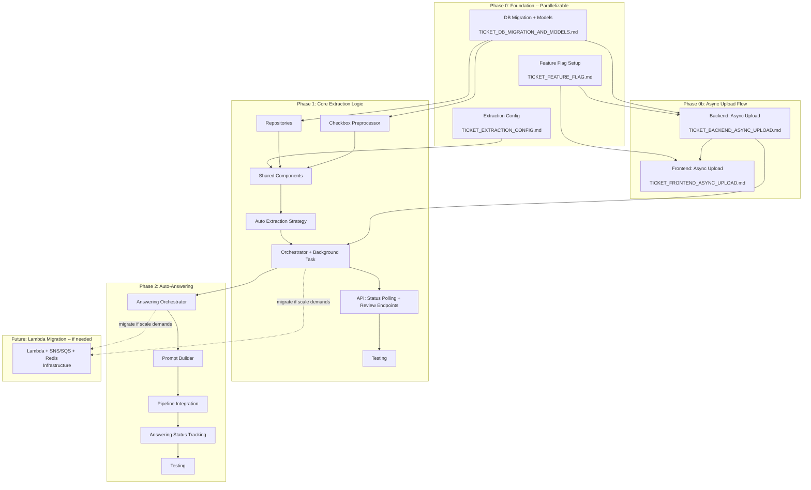
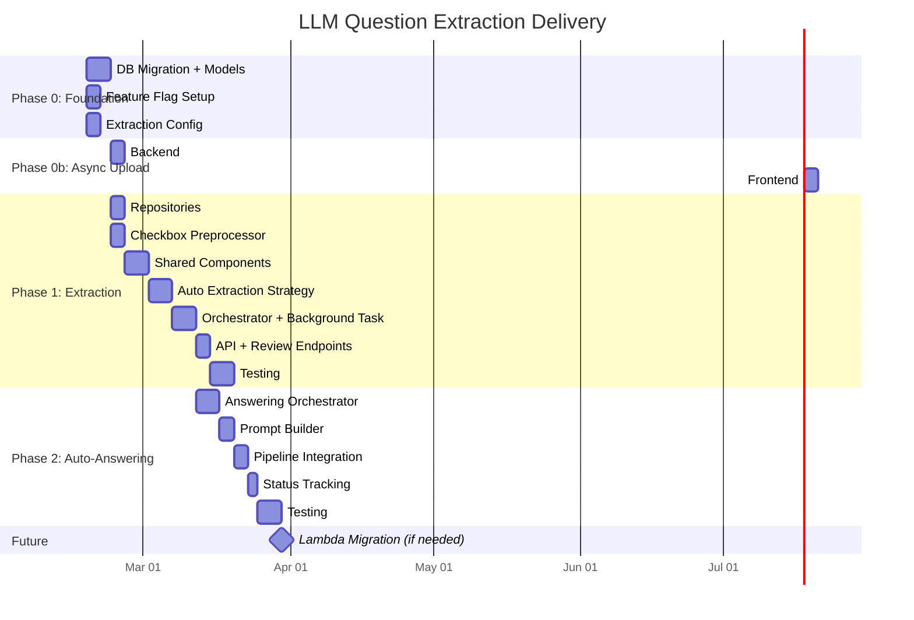

# Big Picture: LLM Question Extraction

## Overview

This document shows all tickets for the LLM question extraction feature, their dependencies, and the phased delivery plan. It covers the current parallelizable foundation work, the async upload flow, the core extraction implementation, and future phases.

---

## Ticket Dependency Diagram

---

## All Tickets

### Phase 0: Foundation (Parallelizable -- no dependencies between them)

| Ticket | File | Description | Assignable |
|--------|------|-------------|------------|
| DB Migration + Models | `TICKET_DB_MIGRATION_AND_MODELS.md` | Alembic migrations and Python model classes for new tables and columns | Yes, independent |
| Feature Flag | `TICKET_FEATURE_FLAG.md` | Register `survey_llm_question_extraction` in AppSettings, verify frontend endpoint | Yes, independent |
| Extraction Config | `TICKET_EXTRACTION_CONFIG.md` | `ExtractionConfig` Pydantic settings class | Yes, independent |

### Phase 0b: Async Upload Flow (depends on Feature Flag + DB Migration)

| Ticket | File | Description | Depends On |
|--------|------|-------------|------------|
| Backend: Async Upload | `TICKET_BACKEND_ASYNC_UPLOAD.md` | Upload endpoint returns 202 with `extraction_status = pending` when flag is enabled; kicks off background task | Feature Flag, DB Migration |
| Frontend: Async Upload | `TICKET_FRONTEND_ASYNC_UPLOAD.md` | Close modal on 202, show survey in list with status, poll for updates; use old sync flow when flag is disabled | Feature Flag, Backend Async Upload |

### Phase 1: Core Extraction Logic (depends on Phase 0)

| Ticket | Description | Depends On |
|--------|-------------|------------|
| Repositories | CRUD for new models + bulk insert | DB Migration |
| Checkbox Preprocessor | Port `checkbox_label_poc.py` to production service | DB Migration |
| Shared Components | MarkdownConverter, XmlResponseParser, QuestionPersister | Repositories, Checkbox Preprocessor, Config |
| Auto Extraction Strategy | Port `approach_auto.py` using shared components | Shared Components |
| Orchestrator + Background Task | ExtractionOrchestrator with strategy selection, timeout, error handling | Strategy, Backend Async Upload |
| API: Status Polling + Review | Status endpoint, review/approve/reject endpoints | Orchestrator |
| Testing | Unit + integration tests for full pipeline | API |

### Phase 2: Auto-Answering (depends on Phase 1)

| Ticket | Description | Depends On |
|--------|-------------|------------|
| Answering Orchestrator | Iterate questions, call `retrieve_and_generate` per question with throttling | Orchestrator |
| Prompt Builder | Enrich dependent question prompts with parent question context | Answering Orchestrator |
| Pipeline Integration | Wire answering into background task, gated by `auto_answer_enabled` | Prompt Builder |
| Answering Status Tracking | `survey.answering_status` progress, extend polling endpoint | Pipeline Integration |
| Testing | Unit + integration tests for answering pipeline | Status Tracking |

### Future: Lambda Migration (if scale demands)

| Ticket | Description | Trigger |
|--------|-------------|---------|
| Lambda + SNS/SQS + Redis | Move orchestration from background task to Lambda fan-out | API server resource pressure, multi-tenant scale, failure isolation needs |

See `ARCHITECTURE.md` for full comparison of Option A (API background task) vs Option B (Lambda).

---

## Delivery Timeline

---

## Key Decision Points

| Decision | Current Choice | Alternative | When to Revisit |
|----------|---------------|-------------|-----------------|
| Extraction orchestration | API background task (Option A) | Lambda + SNS/SQS + Redis (Option B) | Server resource pressure or multi-tenant scale |
| Extraction approach | Approach 1 (Fully Automatic) | Approach 4 (Multi-Step Pipeline) | Accuracy issues with complex questionnaire formats |
| Answering strategy | 1 question = 1 RAG call | Batch dependent questions | Never (rejected due to parsing complexity) |
| Feature flag gating | Upload flow only | Per-phase granularity | If auto-answering needs independent rollout |

---

## Related Documents

- `JIRA_LLM_QUESTION_EXTRACTION.md` -- Parent Jira ticket
- `LLM_EXTRACTION_IMPLEMENTATION_PLAN.md` -- Full implementation plan
- `ARCHITECTURE.md` -- Architecture options, comparison, error handling
- `LLM_EXTRACTION_SUMMARY.md` -- Approach evaluation summary
- `backend/app/services/APPROACH_1.md` -- Approach 1 pipeline documentation
- `backend/app/services/APPROACH_4.md` -- Approach 4 pipeline documentation (future)
