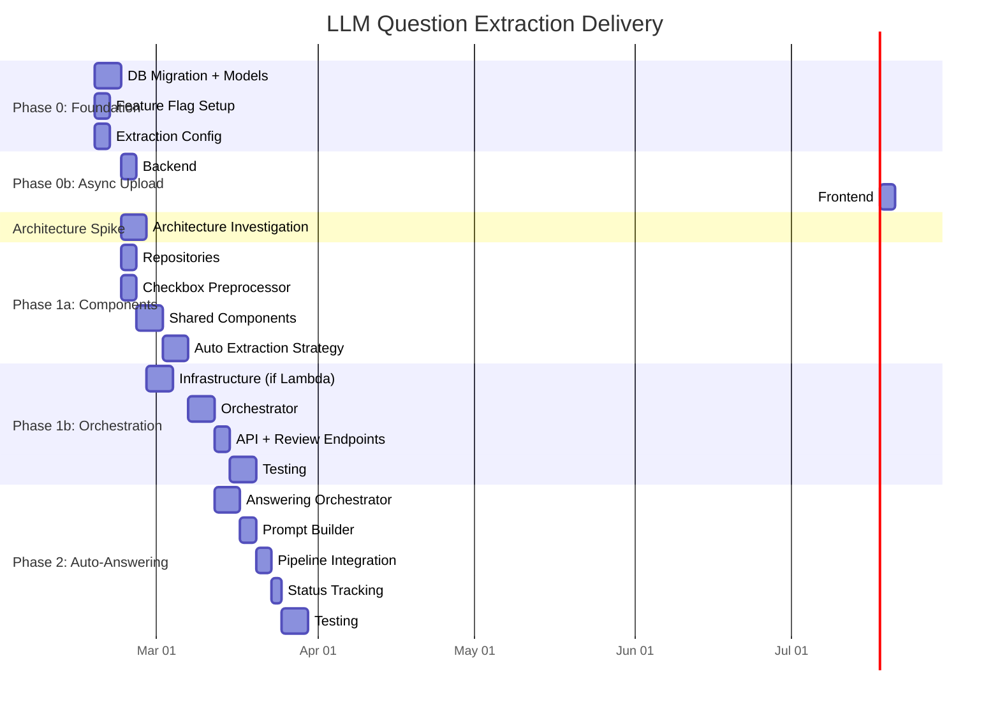

# Big Picture: LLM Question Extraction

## Overview

This document shows all tickets for the LLM question extraction feature, their dependencies, and the phased delivery plan. It covers the foundation work, the async upload flow, an architecture investigation spike, the core extraction implementation, and future phases.

---

## Ticket Dependency Diagram

---

## All Tickets

### Phase 0: Foundation (Parallelizable -- no dependencies between them)

| Ticket | File | Description | Assignable |
|--------|------|-------------|------------|
| DB Migration + Models | `TICKET_DB_MIGRATION_AND_MODELS.md` | Alembic migrations and Python model classes for new tables and columns | Yes, independent |
| Feature Flag | `TICKET_FEATURE_FLAG.md` | Register `survey_llm_question_extraction` in AppSettings, verify frontend endpoint | Yes, independent |
| Extraction Config | `TICKET_EXTRACTION_CONFIG.md` | `ExtractionConfig` Pydantic settings class | Yes, independent |

### Phase 0b: Async Upload Flow (depends on Feature Flag + DB Migration)

| Ticket | File | Description | Depends On |
|--------|------|-------------|------------|
| Backend: Async Upload | `TICKET_BACKEND_ASYNC_UPLOAD.md` | Upload endpoint returns 202 with `extraction_status = pending` when flag is enabled; kicks off background task | Feature Flag, DB Migration |
| Frontend: Async Upload | `TICKET_FRONTEND_ASYNC_UPLOAD.md` | Close modal on 202, show survey in list with status, poll for updates; use old sync flow when flag is disabled | Feature Flag, Backend Async Upload |

### Architecture Investigation Spike (can run in parallel with Phase 0b)

| Ticket | File | Description | Depends On |
|--------|------|-------------|------------|
| Architecture Spike | `TICKET_ARCHITECTURE_SPIKE.md` | Decide between API background task (Option A) and Lambda + SNS/SQS + Redis (Option B) for extraction and answering orchestration. Determine infrastructure needs. | DB Migration, Extraction Config (for context) |

**What this spike decides:**

- Which orchestration approach to use for extraction and answering
- Whether new infrastructure (Lambda, SNS, SQS, Redis) is needed
- Throttling mechanism (code-level semaphore vs SQS maxConcurrency)
- Deployment changes (code-only vs CDK/CloudFormation)

**What does NOT depend on this spike (can proceed in parallel):**

- All Phase 0 and Phase 0b tickets
- Repositories, Checkbox Preprocessor, Shared Components, Auto Extraction Strategy (architecture-agnostic)

**What DOES depend on this spike (blocked until decision is made):**

- Orchestrator implementation
- Infrastructure setup (if Lambda chosen)
- API integration (polling endpoint behavior may differ slightly)

### Phase 1a: Extraction Components -- Architecture-Agnostic (depends on Phase 0)

These tickets produce reusable components that work identically regardless of the architecture decision:

| Ticket | Description | Depends On |
|--------|-------------|------------|
| Repositories | CRUD for new models + bulk insert | DB Migration |
| Checkbox Preprocessor | Port `checkbox_label_poc.py` to production service | DB Migration |
| Shared Components | MarkdownConverter, XmlResponseParser, QuestionPersister | Repositories, Checkbox Preprocessor, Config |
| Auto Extraction Strategy | Port `approach_auto.py` using shared components | Shared Components |

### Phase 1b: Orchestration (depends on Architecture Spike + Phase 1a + Phase 0b)

| Ticket | Description | Depends On |
|--------|-------------|------------|
| Infrastructure (if Lambda) | SNS topics, SQS queues, Redis cluster, Lambda functions via CDK | Architecture Spike |
| Orchestrator | ExtractionOrchestrator -- API background task or Lambda fan-out depending on spike outcome | Architecture Spike, Auto Extraction Strategy, Backend Async Upload, Infrastructure (if Lambda) |
| API: Status Polling + Review | Status endpoint, review/approve/reject endpoints | Orchestrator |
| Testing | Unit + integration tests for full pipeline | API |

### Phase 2: Auto-Answering (depends on Phase 1b)

| Ticket | Description | Depends On |
|--------|-------------|------------|
| Answering Orchestrator | Iterate questions, call `retrieve_and_generate` per question with throttling | Orchestrator |
| Prompt Builder | Enrich dependent question prompts with parent question context | Answering Orchestrator |
| Pipeline Integration | Wire answering into background task or Lambda, gated by `auto_answer_enabled` | Prompt Builder |
| Answering Status Tracking | `survey.answering_status` progress, extend polling endpoint | Pipeline Integration |
| Testing | Unit + integration tests for answering pipeline | Status Tracking |

---

## Delivery Timeline

---

## Key Decision Points

| Decision | Status | Options | Decided By |
|----------|--------|---------|------------|
| Extraction orchestration | **Open -- Architecture Spike** | Option A: API background task vs Option B: Lambda + SNS/SQS + Redis | `TICKET_ARCHITECTURE_SPIKE.md` |
| Extraction approach | Decided: Approach 1 | Approach 1 (Fully Automatic) vs Approach 4 (Multi-Step Pipeline) | Revisit if accuracy issues arise |
| Answering strategy | Decided: 1:1 | 1 question = 1 RAG call with dependency context | Final (batching rejected) |
| Feature flag gating | Decided: upload flow | Async upload when flag enabled, sync when disabled | Revisit if auto-answering needs independent rollout |

---

## Related Documents

- `JIRA_LLM_QUESTION_EXTRACTION.md` -- Parent Jira ticket
- `LLM_EXTRACTION_IMPLEMENTATION_PLAN.md` -- Full implementation plan
- `ARCHITECTURE.md` -- Architecture options (Option A vs Option B), comparison, error handling
- `LLM_EXTRACTION_SUMMARY.md` -- Approach evaluation summary
- `backend/app/services/APPROACH_1.md` -- Approach 1 pipeline documentation
- `backend/app/services/APPROACH_4.md` -- Approach 4 pipeline documentation (future)
