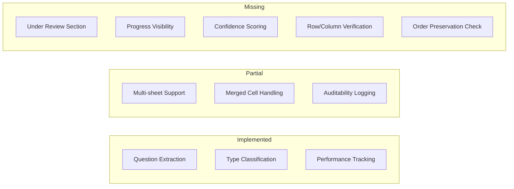
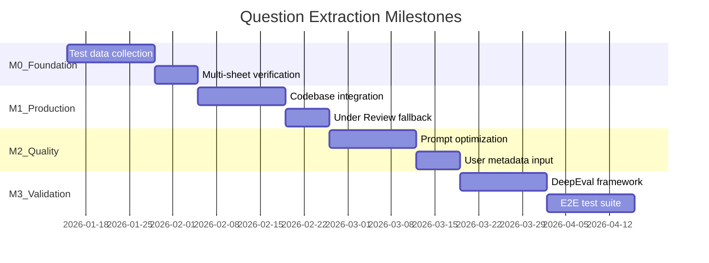

# Excel Question Extraction - POC Status and Roadmap

**Last Updated:** 2026-01-14  
**Status:** POC Complete, Ready for Production Integration  
**Owner:** Swift Survey Development Team

---

## 1. Executive Summary

### Current State

The Excel Question Extraction POC successfully demonstrates automated extraction of survey questions from Excel files using AI. The solution has been validated against real survey data with promising results.

### Key Metrics

| Metric | Value |
|--------|-------|
| Test File | Ecovadis Reassessment Questionnaire 2024 |
| Questions Extracted | 126 |
| Input Size | 49,228 characters |
| Output Tokens | 7,787 |
| Processing Time | 1m 32s |
| Status | Success |

### Technology Stack

```
Excel File (.xlsx)
    ↓
MarkItDown (Microsoft) - Excel to Markdown conversion
    ↓
AWS Bedrock - Claude Sonnet 4 (anthropic.claude-sonnet-4-20250514-v1:0)
    ↓
Ultra-compact XML Output
    ↓
BeautifulSoup XML Parser
    ↓
Structured JSON Results
```

---

## 2. Current Implementation Status

### What Works

| Feature | Status | Notes |
|---------|--------|-------|
| Excel to text conversion | Done | MarkItDown handles .xlsx files with NaN cleanup |
| Question extraction | Done | Claude Sonnet 4 via Bedrock InvokeModel API |
| Question type classification | Done | 5 types implemented |
| Answer option embedding | Done | Pipe-separated format: `(Option A\|Option B\|Option C)` |
| Grouped/matrix questions | Done | Format: `Main question: Subquestion` |
| Performance tracking | Done | Timing metrics for each processing stage |
| JSON output | Done | Structured results with metadata |
| Incomplete XML recovery | Done | Parser adds closing tags if response truncated |
| Configurable timeout | Done | 10-minute read timeout for large files |

### Question Types Implemented

| Type | Description | PM Mapping |
|------|-------------|------------|
| `open_ended` | No predefined answer options | "Open-ended (no subtopics)", "Free-form narrative" |
| `grouped_question` | Main question with subquestions (matrix/battery style) | "Open-ended (with subtopics)" |
| `yes_no` | Binary Yes/No questions | "Yes/No (simple structure)" |
| `single_choice` | One option can be selected | PM: "Cannot process for EAP but visible" |
| `multiple_choice` | Multiple options can be selected | PM: "Cannot process for EAP but visible" |

### Output Format Example

```xml
<questions>
  <q type="open_ended">Full question text here</q>
  <q type="single_choice">Question? (Option A|Option B|Option C)</q>
  <q type="multiple_choice">Question? (Option A|Option B|Option C)</q>
  <q type="grouped_question">Main question: Subquestion text</q>
  <q type="yes_no">Is this correct? (Yes|No)</q>
</questions>
```

---

## 3. Gap Analysis (PM Requirements vs Current POC)

### Visual Overview



### Critical Gaps Table

| PM Requirement | Current Status | Gap Description | Priority |
|----------------|----------------|-----------------|----------|
| **100% row visibility** (Detected + Under Review) | Not implemented | Need "Under Review" fallback section for unclassified content. PM requires all content visible even if not classified. | **High** |
| **Questions split across cells merged** | Partial | `grouped_question` handles some cases. Need explicit multi-cell concatenation logic for questions like "Describe your policy - for data retention". | **High** |
| **Extraction across all worksheets** | Untested | MarkItDown may handle this automatically, but needs verification with multi-sheet test files. | **Medium** |
| **Merged cell handling** | Untested | Excel merged cells may affect MarkItDown extraction. Needs verification with complex formatted files. | **Medium** |
| **Progress bar/visibility** | Not implemented | No streaming or progress feedback. PM requires "Progress bar visible" and "Steps occurring" visibility. | **Medium** |
| **Auditability logging** | Partial | Only question count logged. PM requires: "Detected 114 questions, processed 330 rows". Need row count tracking. | **Medium** |
| **Confidence scoring per question** | Not implemented | Removed from XML format for token efficiency. PM asks: "Not processed means no confidence score or not able to identify?" | **Low** |
| **Order preservation verification** | Untested | Order assumed preserved. PM requires: "Maintain the same order of questions within tabs and from tab to tab". | **Low** |
| **Error handling transparency** | Partial | Basic error handling exists. PM requires: extraction failures visible, status flags for unprocessed content. | **Medium** |

### PM Question Types vs Implementation

| PM Priority | PM Type | Implementation Status | Notes |
|-------------|---------|----------------------|-------|
| **EAP Priority** | Open-ended (no subtopics) | `open_ended` | Implemented |
| **EAP Priority** | Open-ended (with subtopics) | `grouped_question` | Implemented |
| **EAP Priority** | Yes/No (simple structure) | `yes_no` | Implemented |
| **EAP Priority** | Free-form narrative | `open_ended` | Implemented |
| Cannot process (visible) | Instructional/Informational | Not implemented | Should go to "Under Review" |
| Cannot process (visible) | Single Selection | `single_choice` | Implemented but PM says should be "unprocessed" |
| Cannot process (visible) | Multi Selection | `multiple_choice` | Implemented but PM says should be "unprocessed" |
| Cannot process (visible) | Other | Not implemented | Should go to "Under Review" |

**Clarification Needed:** PM documentation says single/multi selection should be "visible as unprocessed" but our POC classifies them. Need to confirm if these should:
- a) Be extracted and classified (current behavior)
- b) Be extracted but flagged as "Under Review"
- c) Not be processed at all

---

## 4. Discussion Topics

### Question Types to Consider Adding

| Type | Current Handling | Discussion Point |
|------|------------------|------------------|
| `rating_scale` | Classified as `single_choice` | Should numeric scales (1-5, 1-10) have explicit type for better UX? |
| `matrix` | Handled via `grouped_question` | Is the Main:Subquestion format sufficient for complex matrices? |
| `ranking` | Not supported | Are ordered preference questions common in target surveys? |
| `instructional` | Not supported | PM mentions these should go to "Under Review". Need to detect and flag them. |

### Architecture Decisions Needed

1. **"Under Review" Implementation**
   - Option A: Separate extraction pass for unclassified content
   - Option B: Integrated with main extraction, questions marked with confidence threshold
   - Option C: Post-processing step that identifies low-confidence or unmatched rows

2. **Confidence Scoring**
   - Removed for token efficiency in current XML format
   - Options to restore:
     - Add `conf="high|medium|low"` attribute to XML (minimal token impact)
     - Calculate confidence in post-processing based on type classification certainty
     - Use Claude's logprobs if available

3. **Progress Visibility**
   - Option A: Streaming responses with incremental updates
   - Option B: Chunked processing with progress callbacks
   - Option C: Estimated time based on file size, shown upfront

4. **Multi-sheet Processing**
   - Verify MarkItDown behavior with multi-sheet Excel files
   - Determine if sheets should be processed sequentially or in parallel
   - Consider sheet-level metadata in output (which question came from which sheet)

### Open Questions for PM

1. Should `single_choice` and `multiple_choice` questions be classified or sent to "Under Review"?
2. What constitutes "instructional" content? Examples needed for prompt engineering.
3. Is 75% detection rate acceptable for EAP, or should we target higher?
4. Should "Under Review" items block Q&A generation, or just be flagged?

---

## 5. Revised Milestones

### Timeline Overview



### Milestone 0: Foundation and Test Data

**Goal:** Establish solid testing foundation before production integration

| Task | Description | Status |
|------|-------------|--------|
| Collect diverse Excel survey files | Different formats, merged cells, multi-sheet, various question types | Pending |
| Verify multi-sheet extraction | Test MarkItDown behavior with multi-sheet Excel files | Pending |
| Test merged cell handling | Validate extraction accuracy with merged cells | Pending |
| Document format edge cases | Catalog problematic Excel patterns discovered | Pending |
| Establish baseline metrics | Measure extraction rate, accuracy, processing time baselines | Pending |

**Success Criteria:**
- Minimum 10 diverse Excel survey files collected
- Multi-sheet extraction verified working or gaps documented
- Merged cell behavior documented
- Baseline accuracy metrics established

---

### Milestone 1: Production Integration

**Goal:** Move POC to production codebase with core PM requirements

| Task | Description | Status |
|------|-------------|--------|
| Move to production codebase | Integrate POC code into enterprise repository | Pending |
| Implement "Under Review" fallback | Unclassified content visible with status flag | Pending |
| Add auditability logging | Log: rows scanned, questions detected, questions classified | Pending |
| Integrate with file upload pipeline | Connect to existing survey upload workflow | Pending |
| Add error handling transparency | Visible error states per PM requirements | Pending |

**Success Criteria:**
- POC code integrated and running in production environment
- "Under Review" section functional for unclassified content
- Audit log showing detection counts
- Error states visible in UI

---

### Milestone 2: Quality Improvements

**Goal:** Improve extraction quality based on test results

| Task | Description | Status |
|------|-------------|--------|
| Prompt optimization | Refine prompts based on M0 test results | Pending |
| Handle split questions | Concatenation logic for questions across multiple columns | Pending |
| User metadata input | Allow users to provide hints for ambiguous structures | Pending |
| Add progress visibility | Streaming or status updates during processing | Pending |
| Evaluate confidence scoring | Determine if/how to add confidence per question | Pending |

**Success Criteria:**
- Improved accuracy on previously problematic files
- Split questions correctly merged
- Progress visible during processing
- Decision made on confidence scoring

---

### Milestone 3: Validation and Testing

**Goal:** Comprehensive quality assurance framework

| Task | Description | Status |
|------|-------------|--------|
| Implement DeepEval framework | LLM output quality evaluation | Pending |
| Create E2E test suite | Automated testing pipeline | Pending |
| Completeness tests | Compare extracted count vs file row count | Pending |
| Accuracy tests | QA sampling with labeled datasets | Pending |
| Classification tests | Verify >75% detection rate (PM criterion) | Pending |
| Performance tests | Load/stress testing with large files | Pending |

**Success Criteria:**
- DeepEval integrated and running
- Automated test suite with CI/CD integration
- >75% question detection rate verified
- Performance benchmarks established

---

### Milestone 4: Advanced Features (Future)

**Goal:** Enhanced capabilities beyond EAP

| Task | Description | Status |
|------|-------------|--------|
| Batch processing | Process multiple files simultaneously | Future |
| Question validation UI | User interface for reviewing/correcting extractions | Future |
| Learning from corrections | Use user corrections to improve future extractions | Future |
| Additional question types | Add `rating_scale`, `matrix`, `ranking` if needed | Future |

---

## 6. Acceptance Criteria Mapping

### PM Criteria to Milestone Mapping

| PM Acceptance Criterion | Milestone | Verification Method |
|------------------------|-----------|---------------------|
| Extract all questions from every sheet, row, column | M0, M1 | Multi-sheet test suite |
| Concatenate questions split across columns | M2 | Test with known split questions |
| Unprocessed content visible with status flag | M1 | "Under Review" section implementation |
| Formatting elements ignored, order maintained | M0, M3 | Order preservation tests |
| Log number of detected questions | M1 | Auditability logging |
| No limit on extraction completion time | M3 | Performance testing |
| System handles memory without timeouts/failures | M3 | Load/stress tests |
| UI shows progress during processing | M2 | Frontend integration |

### Quality Criteria Mapping

| Category | Criterion | Milestone | Verification |
|----------|-----------|-----------|--------------|
| Completeness | 100% of text rows visible in "Detected" or "Under Review" | M1 | Count comparison against original file |
| Accuracy | Questions split across cells merged correctly | M2 | Manual verification with test files |
| Classification | >75% of questions detected | M3 | QA sampling with large datasets |
| Fallback | Undetected content in "Under Review" | M1 | Visual analysis of fallback section |
| Review workflow | User can confirm/reject "Under Review" items | M4 | Functional testing |
| Performance | Estimates available based on file size | M3 | Load testing benchmarks |
| Stability | No timeouts or memory failures | M3 | Stress testing |
| Visibility | Progress bar and steps visible | M2 | Frontend testing |

---

## 7. Technical Notes

### Current Implementation Files

| File | Description |
|------|-------------|
| `excel_question_extraction_poc.py` | Main POC implementation |
| `POC_README.md` | Detailed technical documentation |
| `requirements.txt` | Python dependencies |
| `excel_extraction_poc_results_*.json` | Sample extraction results |
| `*_markitdown_*.md` | MarkItDown extraction outputs |

### Key Configuration

```python
# Model Configuration
BEDROCK_MODEL_ID = "arn:aws:bedrock:us-west-2::inference-profile/global.anthropic.claude-sonnet-4-20250514-v1:0"

# Timeout Configuration
READ_TIMEOUT = 600  # 10 minutes for large files
CONNECT_TIMEOUT = 60
MAX_RETRIES = 3

# Token Limits
MAX_OUTPUT_TOKENS = 8192
```

### Dependencies

```
markitdown[xlsx]>=0.1.3   # Excel to Markdown conversion
beautifulsoup4>=4.12.0    # XML/HTML parsing
lxml>=5.0.0               # Fast XML processing
boto3>=1.34.0             # AWS SDK for Bedrock
botocore>=1.34.0          # AWS core library
```

### Performance Characteristics

| File Size | Characters | Questions | Expected Time | Estimated Cost |
|-----------|------------|-----------|---------------|----------------|
| Small | <10K | 10-30 | 10-20s | ~$0.05 |
| Medium | 10-30K | 30-60 | 30-60s | ~$0.15 |
| Large | 30-50K | 60-150 | 1-2m | ~$0.25 |

---

## 8. Risks and Mitigations

| Risk | Impact | Likelihood | Mitigation |
|------|--------|------------|------------|
| Token limit exceeded for very large files | Incomplete extraction | Medium | Implement chunking strategy in M2 |
| Complex Excel formatting breaks extraction | Missing questions | Medium | Comprehensive testing in M0, fallback in M1 |
| Multi-sheet files not handled correctly | Incomplete extraction | Low | Verify in M0, add sheet tracking |
| Performance degradation at scale | Poor user experience | Medium | Performance testing in M3 |
| Classification accuracy below 75% | PM criteria not met | Low | Prompt optimization in M2, testing in M3 |

---

## 9. Next Steps

1. **Immediate:** Begin M0 - Collect diverse Excel survey files for testing
2. **This Sprint:** Verify multi-sheet and merged cell handling with MarkItDown
3. **Planning:** Clarify PM questions about single/multi choice handling
4. **Technical:** Document any edge cases discovered during testing

---

*Document maintained by Swift Survey Development Team*  
*For questions, contact: [Team Contact]*
