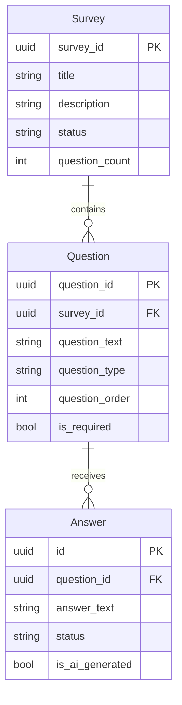
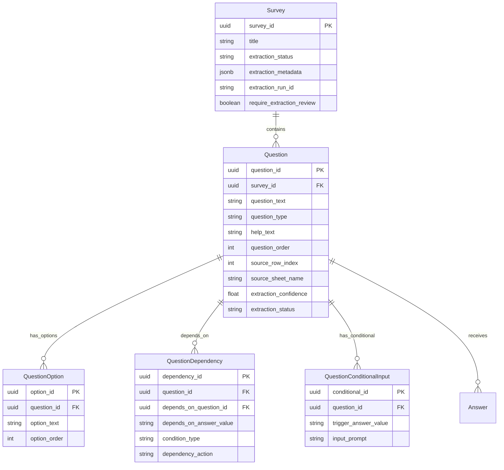
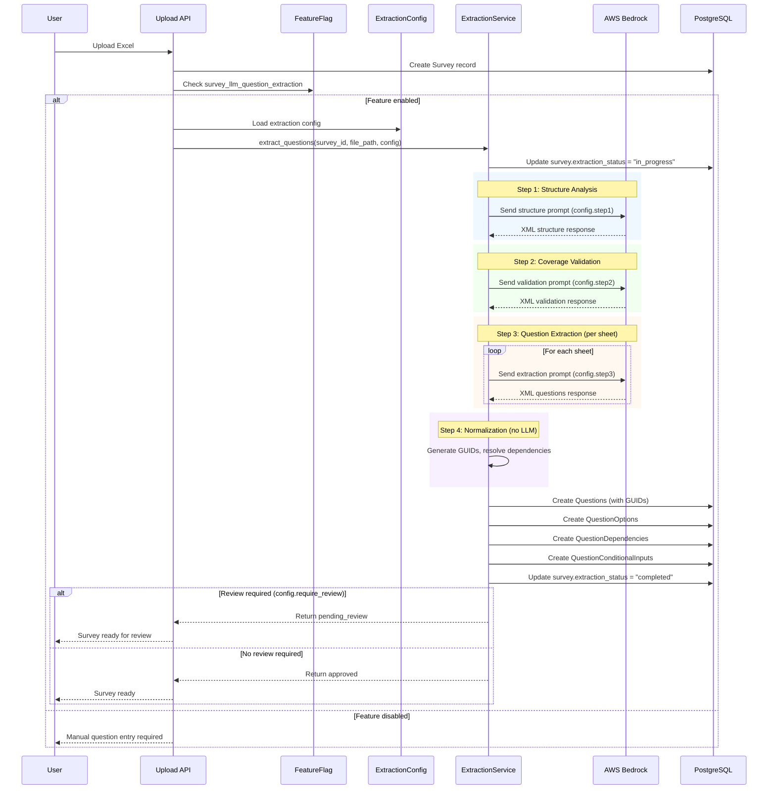

# LLM Question Extraction Implementation Plan

## Overview

This document outlines the implementation plan for integrating the LLM-based question extraction pipeline (Approach 4) into the production backend. The feature automatically extracts questions, answer options, and dependencies from uploaded Excel survey files.

---

## Current State



**Current Limitations:**
- `Question.question_type` is a generic string (no enum)
- No storage for predefined answer options (choices)
- No dependency/conditional logic support
- No help text or instructions
- Manual question entry required after Excel upload

---

## Target State



---

## Feature Flag

**Name:** `survey_llm_question_extraction`

Following the workspace naming convention (`{scope}_{feature}`):
- **Scope:** `survey` - affects survey functionality
- **Feature:** `llm_question_extraction` - LLM-based extraction

**Configuration:**
- Default: `false` (disabled)
- Rollout: Per-tenant configurable
- Controls: Whether extraction runs on upload and review workflow requirement

**LaunchDarkly Setup:**
- Link to this Jira ticket in flag description
- Tags: `survey`, `llm`, `backend`
- Maintainer: Backend team

---

## Pydantic Configuration

Create a dedicated configuration file for per-step model settings:

```python
# config/extraction_config.py

from pydantic import BaseModel, Field
from pydantic_settings import BaseSettings
from typing import Optional


class StepModelConfig(BaseModel):
    """Configuration for a single pipeline step."""
    
    model_id: str = Field(
        description="Bedrock model ID (e.g., anthropic.claude-sonnet-4-5-20250514-v1:0)"
    )
    inference_profile_arn: Optional[str] = Field(
        default=None,
        description="Optional inference profile ARN for cost/performance optimization"
    )
    max_output_tokens: int = Field(
        description="Maximum tokens in LLM response"
    )
    temperature: float = Field(
        default=0.1,
        ge=0.0,
        le=1.0,
        description="LLM temperature (0.0 = deterministic, 1.0 = creative)"
    )


class ExtractionPipelineConfig(BaseSettings):
    """
    Configuration for the 4-step extraction pipeline.
    
    Environment variables override defaults with prefix EXTRACTION_.
    Example: EXTRACTION_ENABLED=true
    """
    
    model_config = {"env_prefix": "EXTRACTION_"}
    
    # Feature toggle
    enabled: bool = Field(
        default=False,
        description="Master switch for LLM extraction feature"
    )
    require_review: bool = Field(
        default=True,
        description="Whether extracted questions require human review"
    )
    
    # Step 1: Structure Analysis
    step1_structure_analysis: StepModelConfig = Field(
        default_factory=lambda: StepModelConfig(
            model_id="anthropic.claude-sonnet-4-5-20250514-v1:0",
            max_output_tokens=8192,
            temperature=0.1
        ),
        description="Model config for analyzing Excel structure"
    )
    
    # Step 2: Coverage Validation
    step2_coverage_validation: StepModelConfig = Field(
        default_factory=lambda: StepModelConfig(
            model_id="anthropic.claude-sonnet-4-5-20250514-v1:0",
            max_output_tokens=4096,
            temperature=0.0  # Deterministic for validation
        ),
        description="Model config for validating structure coverage"
    )
    
    # Step 3: Question Extraction
    step3_question_extraction: StepModelConfig = Field(
        default_factory=lambda: StepModelConfig(
            model_id="anthropic.claude-sonnet-4-5-20250514-v1:0",
            max_output_tokens=16384,
            temperature=0.1
        ),
        description="Model config for extracting questions (largest output)"
    )
    
    # Global settings
    extraction_timeout_seconds: int = Field(
        default=300,
        description="Maximum time for entire extraction pipeline"
    )
    max_retries: int = Field(
        default=3,
        description="Number of retries on LLM failure"
    )
    save_intermediate_results: bool = Field(
        default=True,
        description="Whether to save intermediate XML/JSON for debugging"
    )
    intermediate_results_bucket: Optional[str] = Field(
        default=None,
        description="S3 bucket for intermediate results (optional)"
    )


# Singleton instance
extraction_config = ExtractionPipelineConfig()
```

**Usage in service:**

```python
from config.extraction_config import extraction_config

class QuestionExtractionService:
    async def _run_step1(self, file_path: str) -> dict:
        config = extraction_config.step1_structure_analysis
        response = await self._invoke_llm(
            prompt=self._build_structure_prompt(file_path),
            model_id=config.model_id,
            max_tokens=config.max_output_tokens,
            temperature=config.temperature,
            inference_profile_arn=config.inference_profile_arn
        )
        return self._parse_structure(response)
```

---

## Integration Flow



---

## Database Migrations

| Order | Migration | Description |
|-------|-----------|-------------|
| 1 | `add_question_type_enum` | Create `question_type_enum` type |
| 2 | `create_question_options_table` | New table for answer choices |
| 3 | `create_question_dependencies_table` | New table for conditional logic |
| 4 | `create_question_conditional_inputs_table` | New table for "if yes, provide detail" |
| 5 | `alter_questions_add_extraction_fields` | Add help_text, source_row_index, extraction_confidence, etc. |
| 6 | `alter_surveys_add_extraction_fields` | Add extraction_status, extraction_metadata, etc. |

---

## New Database Models

### QuestionType Enum

```python
class QuestionType(str, Enum):
    """Question types supported by the extraction system."""
    OPEN_ENDED = "open_ended"
    SINGLE_CHOICE = "single_choice"
    MULTIPLE_CHOICE = "multiple_choice"
    YES_NO = "yes_no"
    NUMERIC = "numeric"
    INTEGER = "integer"
    DECIMAL = "decimal"
```

### QuestionOption Model

```python
class QuestionOption(SwiftModel):
    """Predefined answer option for a question."""
    
    option_id: str              # UUID PK
    question_id: str            # FK to Question
    option_text: str            # The option text (e.g., "Yes", "Manufacturing")
    option_order: int           # Display order (0-based)
    tenant_id: str              # Tenant isolation
```

### QuestionDependency Model

```python
class QuestionDependency(SwiftModel):
    """Conditional dependency between questions."""
    
    dependency_id: str              # UUID PK
    question_id: str                # FK - the dependent question
    depends_on_question_id: str     # FK - the parent question (GUID)
    depends_on_answer_value: str    # Trigger value (e.g., "Yes", "No")
    condition_type: str             # "equals", "contains", "not_empty"
    dependency_action: str          # "show" or "skip"
    tenant_id: str
```

### QuestionConditionalInput Model

```python
class QuestionConditionalInput(SwiftModel):
    """Additional input prompt triggered by answer selection."""
    
    conditional_id: str         # UUID PK
    question_id: str            # FK to Question
    trigger_answer_value: str   # Answer that triggers input (e.g., "Yes")
    input_prompt: str           # Prompt text (e.g., "please provide detail")
    tenant_id: str
```

### Enhanced Question Model

Add fields to existing Question:

```python
# New fields for Question model
help_text: Optional[str] = None              # Instructions/comments
source_row_index: Optional[int] = None       # Excel row for traceability
source_sheet_name: Optional[str] = None      # Excel sheet name
extraction_confidence: Optional[float] = None # LLM confidence (0.0-1.0)
extraction_status: str = "approved"          # "pending_review", "approved", "rejected"
```

### Enhanced Survey Model

Add fields to existing Survey:

```python
# New fields for Survey model
extraction_status: str = "not_started"       # "not_started", "in_progress", "completed", "failed", "partial"
extraction_metadata: Optional[dict] = None   # LLM metrics, timestamps, model used
extraction_run_id: Optional[str] = None      # UUID for debugging/traceability
require_extraction_review: bool = True       # Configurable per survey
```

---

## API Endpoints

### New Endpoints

| Method | Path | Description |
|--------|------|-------------|
| `GET` | `/surveys/{survey_id}/extraction/status` | Get extraction status and metrics |
| `POST` | `/surveys/{survey_id}/extraction/retry` | Retry failed extraction |
| `GET` | `/surveys/{survey_id}/questions/pending-review` | List questions pending review |
| `POST` | `/surveys/{survey_id}/questions/approve` | Approve extracted questions |
| `POST` | `/surveys/{survey_id}/questions/reject` | Reject extracted questions |

### Modified Endpoints

| Method | Path | Change |
|--------|------|--------|
| `POST` | `/surveys/upload` | Trigger extraction if feature enabled |
| `GET` | `/surveys/{survey_id}/questions` | Include options, dependencies, conditional inputs |
| `GET` | `/surveys/{survey_id}` | Include extraction_status in response |

---

## Service Layer

### QuestionExtractionService

```python
class QuestionExtractionService:
    """Orchestrates LLM-based question extraction from Excel surveys."""
    
    def __init__(
        self,
        bedrock_client: BedrockClient,
        config: ExtractionPipelineConfig,
        question_repo: QuestionRepository,
        option_repo: QuestionOptionRepository,
        dependency_repo: QuestionDependencyRepository,
        conditional_repo: QuestionConditionalInputRepository,
        survey_repo: SurveyRepository,
    ):
        self.bedrock = bedrock_client
        self.config = config
        # ... repos
    
    async def extract_questions(
        self,
        survey_id: str,
        file_path: str,
        tenant_id: str,
    ) -> ExtractionResult:
        """
        Run 4-step pipeline extraction.
        
        Returns:
            ExtractionResult with questions, metrics, and status
        """
        
    async def approve_questions(
        self,
        survey_id: str,
        question_ids: List[str],
        tenant_id: str,
        approved_by: str,
    ) -> None:
        """Approve extracted questions after review."""
        
    async def reject_questions(
        self,
        survey_id: str,
        question_ids: List[str],
        tenant_id: str,
        rejected_by: str,
        reason: str,
    ) -> None:
        """Reject extracted questions."""
```

---

## Error Handling

| Scenario | Handling |
|----------|----------|
| LLM timeout | Retry up to `config.max_retries` times, then mark as "failed" |
| Partial extraction | Save extracted questions, mark survey as "partial" |
| Invalid Excel format | Return validation error before extraction starts |
| Feature flag off | Skip extraction, allow manual entry |
| Bedrock unavailable | Log error, mark as "failed", allow manual retry |

---

## Observability

### Metrics

- `extraction_duration_ms` - Total pipeline duration
- `extraction_step_duration_ms` - Duration per step (labeled by step)
- `extraction_questions_count` - Number of questions extracted
- `extraction_llm_calls_count` - Number of LLM invocations
- `extraction_errors_count` - Extraction failures (labeled by error type)

### Logging

```python
logger.info(
    "Extraction completed",
    extra={
        "survey_id": survey_id,
        "tenant_id": tenant_id,
        "extraction_run_id": run_id,
        "questions_extracted": len(questions),
        "duration_ms": duration,
        "model_id": config.step3_question_extraction.model_id,
    }
)
```

### Tracing

- Request ID propagation through all extraction steps
- Correlation with Bedrock invocation IDs
- Intermediate results stored with run_id for debugging

---

## Implementation Order

1. **Feature Flag** - Register in LaunchDarkly
2. **Pydantic Config** - Create `extraction_config.py`
3. **Database Migrations** - All 6 migrations
4. **Models** - QuestionOption, QuestionDependency, QuestionConditionalInput
5. **Repositories** - CRUD for new models
6. **Service** - Port `approach_pipeline.py` as `QuestionExtractionService`
7. **API Integration** - Upload flow + review endpoints
8. **Testing** - Unit + integration tests

---

## Testing Strategy

### Unit Tests

- Config validation and defaults
- GUID generation and dependency resolution
- XML parsing edge cases
- Question type mapping

### Integration Tests

- Full extraction pipeline with mock Bedrock
- Feature flag toggle behavior
- Review workflow (approve/reject)
- Multi-sheet Excel handling

### Manual Testing

- Various Excel formats (ESG surveys, vendor questionnaires)
- Large files (500+ questions)
- Error scenarios (malformed Excel, LLM failures)

---

## Rollout Plan

1. **Phase 1: Internal Testing**
   - Enable for internal tenant only
   - Require review for all extractions
   - Monitor error rates and accuracy

2. **Phase 2: Beta**
   - Enable for select beta tenants
   - Gather feedback on extraction quality
   - Tune model parameters if needed

3. **Phase 3: GA**
   - Enable for all tenants (opt-in)
   - Make review configurable per tenant
   - Document in user guides
