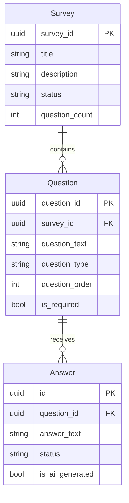
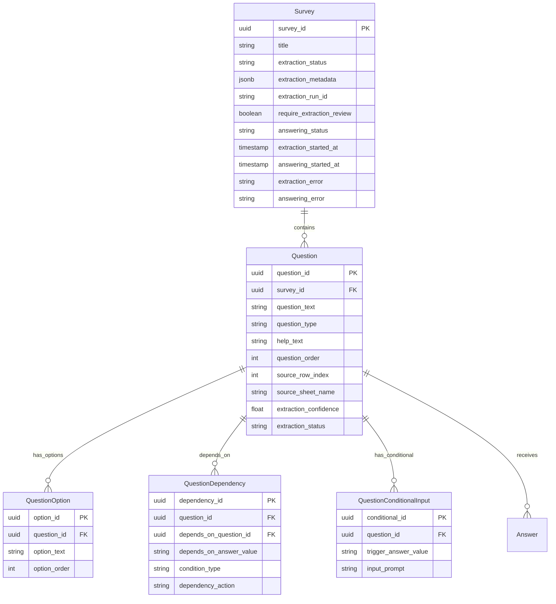
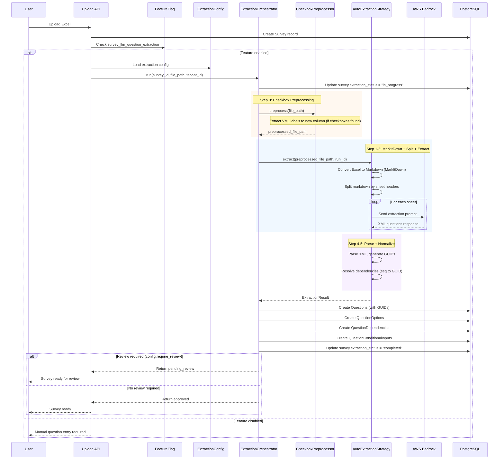
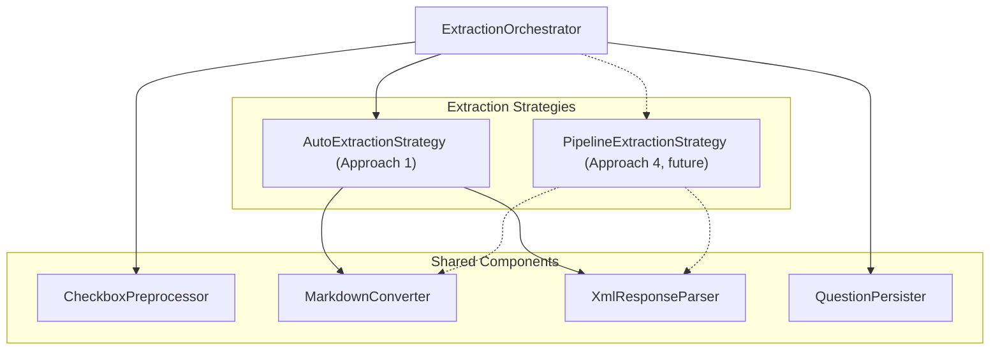

# LLM Question Extraction Implementation Plan

## Overview

This document outlines the implementation plan for integrating LLM-based question extraction into the production backend. The initial implementation uses **Approach 1 (Fully Automatic)** — the simplest and most proven extraction method. The architecture is designed with a **Strategy pattern** so that it can be extended to Approach 4 (Multi-Step Pipeline) if higher accuracy is needed for complex questionnaire formats, without requiring database or API changes.

The feature automatically extracts questions, answer options, help text, conditional inputs, and dependencies from uploaded Excel survey files using per-sheet LLM calls.

See [APPROACH_1.md](backend/app/services/APPROACH_1.md) for detailed technical documentation of the extraction pipeline.

### Architecture Decision

The extraction (and future auto-answering) pipeline runs as a **backend API background task** on the long-lived server process. The API returns a 202 immediately and the frontend polls for status. This approach was chosen over Lambda fan-out for simplicity, debuggability, and direct reuse of existing services. Bedrock rate limits require throttling in both approaches, reducing Lambda's speed advantage.

See [ARCHITECTURE.md](ARCHITECTURE.md) for the full architecture documentation, including:
- Two-phase pipeline (extraction + auto-answering)
- Answering strategy (1 question = 1 `retrieve_and_generate` call, with dependency context)
- Parallel processing with `asyncio.Semaphore` throttling
- Lambda alternative (deferred)

---

## Current State



**Current Limitations:**
- `Question.question_type` is a generic string (no enum)
- No storage for predefined answer options (choices)
- No dependency/conditional logic support
- No help text or instructions
- Manual question entry required after Excel upload

---

## Target State



---

## Feature Flag

**Name:** `survey_llm_question_extraction`

Following the workspace naming convention (`{scope}_{feature}`):
- **Scope:** `survey` - affects survey functionality
- **Feature:** `llm_question_extraction` - LLM-based extraction

**Configuration:**
- Default: `false` (disabled)
- Rollout: Per-tenant configurable
- Controls: Whether extraction runs on upload and review workflow requirement

**LaunchDarkly Setup:**
- Link to this Jira ticket in flag description
- Tags: `survey`, `llm`, `backend`
- Maintainer: Backend team

---

## Pydantic Configuration

> **Ticket**: See `TICKET_EXTRACTION_CONFIG.md` for the implementation ticket.

Create a single merged `ExtractionConfig` settings class for the extraction service. Model-level fields (model_id, temperature, etc.) are flattened directly into the main config rather than nested in a separate class. This simplifies environment variable overrides (e.g., `EXTRACTION_MODEL_ID=...` instead of requiring nested config).

```python
# config/extraction_config.py

from pydantic import Field
from pydantic_settings import BaseSettings
from typing import Literal, Optional


class ExtractionConfig(BaseSettings):
    """
    Configuration for the LLM question extraction pipeline.
    
    All fields can be overridden via environment variables with EXTRACTION_ prefix.
    Example: EXTRACTION_ENABLED=true, EXTRACTION_MODEL_ID=anthropic.claude-sonnet-4-5-20250929-v1:0
    """
    
    model_config = {"env_prefix": "EXTRACTION_"}
    
    # --- Feature toggle ---
    enabled: bool = Field(
        default=False,
        description="Master switch for LLM extraction feature"
    )
    require_review: bool = Field(
        default=True,
        description="Whether extracted questions require human review before approval"
    )
    
    # --- Approach selection ---
    approach: Literal["auto", "pipeline"] = Field(
        default="auto",
        description=(
            "'auto' = Approach 1 (MarkItDown + per-sheet LLM). "
            "'pipeline' = Approach 4 (structure analysis + filtered extraction). "
            "Start with 'auto'; switch to 'pipeline' if accuracy needs improvement."
        )
    )
    
    # --- Model configuration (Approach 1 uses these directly) ---
    model_id: str = Field(
        default="anthropic.claude-sonnet-4-5-20250929-v1:0",
        description="Bedrock model ID for question extraction"
    )
    inference_profile_arn: Optional[str] = Field(
        default=None,
        description="Optional inference profile ARN for cost/performance optimization"
    )
    max_output_tokens: int = Field(
        default=32768,
        description="Maximum tokens in LLM response"
    )
    temperature: float = Field(
        default=0.1,
        ge=0.0,
        le=1.0,
        description="LLM temperature (0.0 = deterministic, 1.0 = creative)"
    )
    
    # --- Preprocessing ---
    checkbox_preprocessing_enabled: bool = Field(
        default=True,
        description=(
            "Extract checkbox labels from VML drawings before MarkItDown conversion. "
            "Only applies to .xlsx files with embedded checkboxes."
        )
    )
    
    # --- Reserved for Approach 4 (not used in initial implementation) ---
    # When upgrading to Approach 4, add per-step model configs here:
    # step1_model_id: str (structure analysis model)
    # step1_max_output_tokens: int
    # step1_temperature: float
    # step2_model_id: str (coverage validation model)
    # step2_max_output_tokens: int
    # step2_temperature: float
    # step3_model_id: str (question extraction model)
    # step3_max_output_tokens: int
    # step3_temperature: float
    
    # --- Global settings ---
    extraction_timeout_seconds: int = Field(
        default=300,
        description="Maximum time for entire extraction pipeline in seconds"
    )
    max_retries: int = Field(
        default=3,
        description="Number of retries on LLM failure per sheet"
    )
    save_intermediate_results: bool = Field(
        default=True,
        description="Whether to save intermediate XML/JSON for debugging"
    )
    intermediate_results_bucket: Optional[str] = Field(
        default=None,
        description="S3 bucket for intermediate results (optional, local if not set)"
    )


# Singleton instance
extraction_config = ExtractionConfig()
```

**Usage in service:**

```python
from config.extraction_config import extraction_config

class AutoExtractionStrategy:
    async def extract(self, file_path: str, run_id: str | None = None) -> ExtractionResult:
        response = await self._invoke_llm(
            prompt=self._build_prompt(sheet_content, sheet_name),
            model_id=extraction_config.model_id,
            max_tokens=extraction_config.max_output_tokens,
            temperature=extraction_config.temperature,
            inference_profile_arn=extraction_config.inference_profile_arn,
        )
        return self._parse_response(response)
```

---

## Integration Flow



---

## Service Layer — Extensible Architecture

The service layer uses a **Strategy pattern** with shared components to enable easy extension from Approach 1 to Approach 4 without changing the orchestrator, database, or API layers.



> Dashed lines indicate the future Approach 4 path. Solid lines are the initial Approach 1 implementation.

### ExtractionStrategy Protocol

```python
from typing import Protocol

class ExtractionStrategy(Protocol):
    """Interface for extraction approaches.
    
    Both Approach 1 (auto) and Approach 4 (pipeline) implement this.
    The orchestrator selects the strategy based on config.approach.
    """
    
    async def extract(
        self,
        file_path: str,
        run_id: str | None = None,
        tenant_id: str | None = None,
    ) -> ExtractionResult: ...
```

### Shared Components

| Component | Responsibility | Used By |
|-----------|---------------|---------|
| `CheckboxPreprocessor` | Extract VML checkbox labels, write to temp column, manage temp files | Both approaches |
| `MarkdownConverter` | MarkItDown wrapper + NaN cleanup + CSV fallback | Both approaches |
| `XmlResponseParser` | XML parsing, GUID generation, dependency resolution (two-pass) | Both approaches |
| `QuestionPersister` | Bulk DB writes for questions, options, dependencies, conditional inputs | Both approaches |

### ExtractionOrchestrator

```python
class ExtractionOrchestrator:
    """Orchestrates the full extraction pipeline.
    
    Coordinates preprocessing, strategy execution, and persistence.
    Selects strategy based on config.approach.
    """
    
    def __init__(
        self,
        config: ExtractionConfig,
        preprocessor: CheckboxPreprocessor,
        auto_strategy: AutoExtractionStrategy,
        # pipeline_strategy: PipelineExtractionStrategy,  # Future
        persister: QuestionPersister,
        survey_repo: SurveyRepository,
    ):
        self.config = config
        self.preprocessor = preprocessor
        self.persister = persister
        self.survey_repo = survey_repo
        
        # Strategy selection
        self._strategies: dict[str, ExtractionStrategy] = {
            "auto": auto_strategy,
            # "pipeline": pipeline_strategy,  # Future: Approach 4
        }
    
    async def run(
        self,
        survey_id: str,
        file_path: str,
        tenant_id: str,
    ) -> ExtractionResult:
        """
        Run the full extraction pipeline:
        1. Preprocess (checkbox labels)
        2. Extract (strategy-dependent)
        3. Persist (DB writes)
        """
        # Update status
        await self.survey_repo.update_extraction_status(
            survey_id, "in_progress", tenant_id
        )
        await self.survey_repo.set_extraction_started_at(
            survey_id, datetime.utcnow(), tenant_id
        )
        
        try:
            # Wrap in timeout to prevent hanging
            result = await asyncio.wait_for(
                self._run_extraction(file_path, survey_id, tenant_id),
                timeout=self.config.extraction_timeout_seconds,
            )
            
            # Update status
            status = "completed" if result.success else "partial" if result.questions else "failed"
            await self.survey_repo.update_extraction_status(
                survey_id, status, tenant_id,
                metadata=result.metrics.model_dump() if result.metrics else None,
            )
            
            return result
            
        except asyncio.TimeoutError:
            logger.error("Extraction timed out", extra={
                "survey_id": survey_id,
                "timeout_seconds": self.config.extraction_timeout_seconds,
            })
            await self.survey_repo.update_extraction_status(
                survey_id, "failed", tenant_id,
                error=f"Extraction timed out after {self.config.extraction_timeout_seconds}s",
            )
            return None
            
        except Exception as e:
            logger.error("Extraction failed", extra={
                "survey_id": survey_id, "error": str(e),
            })
            await self.survey_repo.update_extraction_status(
                survey_id, "failed", tenant_id,
                error=str(e),
            )
            # Do NOT re-raise: the background task must set a terminal status, not crash
            return None
    
    async def _run_extraction(
        self, file_path: str, survey_id: str, tenant_id: str
    ) -> ExtractionResult:
        """Inner extraction logic, wrapped by timeout and error handling."""
        # Step 0: Preprocess
        preprocessed_path = file_path
        if self.config.checkbox_preprocessing_enabled:
            preprocessed_path = self.preprocessor.preprocess(file_path)
        
        # Select strategy
        strategy = self._strategies[self.config.approach]
        
        # Run extraction
        result = await strategy.extract(
            preprocessed_path,
            run_id=f"run_{survey_id}",
            tenant_id=tenant_id,
        )
        
        # Persist results
        if result.success and result.questions:
            await self.persister.persist(
                survey_id=survey_id,
                questions=result.questions,
                tenant_id=tenant_id,
                require_review=self.config.require_review,
            )
        
        return result
    
    async def approve_questions(
        self,
        survey_id: str,
        question_ids: list[str],
        tenant_id: str,
        approved_by: str,
    ) -> None:
        """Approve extracted questions after review."""
        
    async def reject_questions(
        self,
        survey_id: str,
        question_ids: list[str],
        tenant_id: str,
        rejected_by: str,
        reason: str,
    ) -> None:
        """Reject extracted questions."""
```

### AutoExtractionStrategy (Approach 1)

```python
class AutoExtractionStrategy:
    """Fully automatic extraction: MarkItDown + per-sheet LLM.
    
    Ported from POC approach_auto.py.
    """
    
    def __init__(
        self,
        bedrock_client: BedrockClient,
        config: StepModelConfig,
        markdown_converter: MarkdownConverter,
        xml_parser: XmlResponseParser,
    ):
        self.bedrock = bedrock_client
        self.config = config
        self.converter = markdown_converter
        self.parser = xml_parser
    
    async def extract(
        self,
        file_path: str,
        run_id: str | None = None,
        tenant_id: str | None = None,
    ) -> ExtractionResult:
        """
        1. Convert Excel to Markdown
        2. Split by sheet headers
        3. LLM extraction per sheet
        4. Parse XML + GUID generation
        5. Dependency resolution
        """
```

---

## Database Migrations

| Order | Migration | Description |
|-------|-----------|-------------|
| 1 | `add_question_type_enum` | Create `question_type_enum` type |
| 2 | `create_question_options_table` | New table for answer choices |
| 3 | `create_question_dependencies_table` | New table for conditional logic |
| 4 | `create_question_conditional_inputs_table` | New table for "if yes, provide detail" |
| 5 | `alter_questions_add_extraction_fields` | Add help_text, source_row_index, extraction_confidence, etc. |
| 6 | `alter_surveys_add_extraction_fields` | Add extraction_status, extraction_metadata, etc. |

> **Note**: These migrations are forward-compatible with both Approach 1 and Approach 4. All fields (`help_text`, `dependencies`, `conditional_inputs`, `source_sheet_name`) are populated by Approach 1 already. No database changes are needed when upgrading to Approach 4.

---

## New Database Models

### QuestionType Enum

```python
class QuestionType(str, Enum):
    """Question types supported by the extraction system."""
    OPEN_ENDED = "open_ended"
    SINGLE_CHOICE = "single_choice"
    MULTIPLE_CHOICE = "multiple_choice"
    YES_NO = "yes_no"
    NUMERIC = "numeric"
    INTEGER = "integer"
    DECIMAL = "decimal"
```

### QuestionOption Model

```python
class QuestionOption(SwiftModel):
    """Predefined answer option for a question."""
    
    option_id: str              # UUID PK
    question_id: str            # FK to Question
    option_text: str            # The option text (e.g., "Yes", "Manufacturing")
    option_order: int           # Display order (0-based)
```

### QuestionDependency Model

```python
class QuestionDependency(SwiftModel):
    """Conditional dependency between questions."""
    
    dependency_id: str              # UUID PK
    question_id: str                # FK - the dependent question
    depends_on_question_id: str     # FK - the parent question (GUID)
    depends_on_answer_value: str    # Trigger value (e.g., "Yes", "No")
    condition_type: str             # "equals", "contains", "not_empty"
    dependency_action: str          # "show" or "skip"
```

### QuestionConditionalInput Model

```python
class QuestionConditionalInput(SwiftModel):
    """Additional input prompt triggered by answer selection."""
    
    conditional_id: str         # UUID PK
    question_id: str            # FK to Question
    trigger_answer_value: str   # Answer that triggers input (e.g., "Yes")
    input_prompt: str           # Prompt text (e.g., "please provide detail")
```

### Enhanced Question Model

Add fields to existing Question:

```python
# New fields for Question model
help_text: Optional[str] = None              # Instructions/comments
source_row_index: Optional[int] = None       # Excel row for traceability
source_sheet_name: Optional[str] = None      # Excel sheet name
extraction_confidence: Optional[float] = None # LLM confidence (0.0-1.0)
extraction_status: str = "approved"          # "pending_review", "approved", "rejected"
```

### Enhanced Survey Model

Add fields to existing Survey:

```python
# New fields for Survey model
extraction_status: str = "not_started"                    # "not_started", "in_progress", "completed", "failed", "partial"
extraction_metadata: Optional[dict] = None                # LLM metrics, timestamps, model used
extraction_run_id: Optional[str] = None                   # UUID for debugging/traceability
require_extraction_review: bool = True                    # Configurable per survey
answering_status: str = "not_started"                     # "not_started", "in_progress", "completed", "failed", "partial"
extraction_started_at: Optional[datetime] = None          # When extraction began; for stale job recovery + frontend timeout
answering_started_at: Optional[datetime] = None           # When answering began; same purpose
extraction_error: Optional[str] = None                    # Human-readable error for frontend display
answering_error: Optional[str] = None                     # Human-readable error for frontend display
```

---

## API Endpoints

### New Endpoints

| Method | Path | Description |
|--------|------|-------------|
| `GET` | `/surveys/{survey_id}/extraction/status` | Get extraction status and metrics |
| `POST` | `/surveys/{survey_id}/extraction/retry` | Retry failed extraction |
| `GET` | `/surveys/{survey_id}/questions/pending-review` | List questions pending review |
| `POST` | `/surveys/{survey_id}/questions/approve` | Approve extracted questions |
| `POST` | `/surveys/{survey_id}/questions/reject` | Reject extracted questions |

### Modified Endpoints

| Method | Path | Change |
|--------|------|--------|
| `POST` | `/surveys/upload` | Trigger extraction if feature enabled |
| `GET` | `/surveys/{survey_id}/questions` | Include options, dependencies, conditional inputs |
| `GET` | `/surveys/{survey_id}` | Include extraction_status in response |

---

## Error Handling

> See [ARCHITECTURE.md](ARCHITECTURE.md) for the full multi-layer error handling strategy (try/catch, timeouts, stale job recovery, frontend polling timeout).

### Per-Scenario Handling

| Scenario | Handling |
|----------|----------|
| LLM timeout | Retry up to `config.max_retries` times, then mark as "failed" |
| Partial extraction | Save extracted questions, mark survey as "partial" |
| Per-sheet failure | Other sheets' results are preserved; failed sheet contributes 0 questions |
| Incomplete XML | Parser appends `</questions>` and recovers questions before truncation |
| Invalid Excel format | Return validation error before extraction starts |
| Feature flag off | Skip extraction, allow manual entry |
| Bedrock unavailable | Log error, mark as "failed", allow manual retry |
| No VML checkboxes | Preprocessing is a no-op; pipeline continues normally |
| Unhandled exception | Top-level try/catch sets status to "failed" with error message; never leaves job in "in_progress" |
| Pipeline timeout | `asyncio.wait_for` enforces max duration; sets status to "failed" on timeout |
| Server crash/restart | Startup recovery routine detects stale `in_progress` jobs and marks them "failed" |

### Guarantees

- **No job is ever permanently stuck in `in_progress`**: every code path terminates in a `completed`, `partial`, or `failed` status
- **Frontend always gets a terminal signal**: the status endpoint returns `extraction_error`/`answering_error` messages for display, and `started_at` timestamps for client-side timeout enforcement
- **Manual retry is always available**: `POST /surveys/{survey_id}/extraction/retry` resets status and re-triggers the pipeline

---

## Observability

### Metrics

- `extraction_duration_ms` - Total pipeline duration
- `extraction_llm_calls_count` - Number of per-sheet LLM invocations
- `extraction_questions_count` - Number of questions extracted
- `extraction_tokens_input` - Approximate total input tokens
- `extraction_tokens_output` - Approximate total output tokens
- `extraction_errors_count` - Extraction failures (labeled by error type)
- `extraction_checkbox_preprocessing_ms` - Checkbox preprocessing duration (if applicable)

### Logging

```python
logger.info(
    "Extraction completed",
    extra={
        "survey_id": survey_id,
        "tenant_id": tenant_id,
        "extraction_run_id": run_id,
        "approach": config.approach,
        "questions_extracted": len(questions),
        "sheets_processed": total_llm_calls,
        "duration_ms": duration,
        "model_id": config.extraction.model_id,
        "checkbox_preprocessing": config.checkbox_preprocessing_enabled,
    }
)
```

### Tracing

- Request ID propagation through all extraction steps
- Correlation with Bedrock invocation IDs
- Intermediate results stored with run_id for debugging

---

## Implementation Order

### Phase 0: Parallelizable Foundation (can be worked on simultaneously)

These three items have no dependencies on each other and can be developed in parallel by different developers:

| Ticket | Description | File |
|--------|-------------|------|
| Database Migration + Models | Alembic migrations and Python model classes | `TICKET_DB_MIGRATION_AND_MODELS.md` |
| Feature Flag | LaunchDarkly flag registration and frontend endpoint investigation | `TICKET_FEATURE_FLAG.md` |
| Extraction Configuration | Merged `ExtractionConfig` Pydantic settings class | `TICKET_EXTRACTION_CONFIG.md` |

### Phase 0b: Async Upload Flow (depends on Feature Flag + DB Migration)

| Ticket | Description | File |
|--------|-------------|------|
| Backend: Async Upload | Upload endpoint returns 202 with pending status when flag enabled; old sync flow when disabled | `TICKET_BACKEND_ASYNC_UPLOAD.md` |
| Frontend: Async Upload | Close modal on 202, show survey in list with status, poll for updates; old flow when flag disabled | `TICKET_FRONTEND_ASYNC_UPLOAD.md` |

### Architecture Investigation Spike (can run in parallel with Phase 0b)

> See `TICKET_ARCHITECTURE_SPIKE.md`

Decide between API background task (Option A) and Lambda + SNS/SQS + Redis (Option B). This gates the Orchestrator implementation but does **not** block the architecture-agnostic extraction components below.

### Phase 1a: Extraction Components -- Architecture-Agnostic (depends on Phase 0)

5. **Repositories** - CRUD for new models + bulk insert methods
6. **Checkbox Preprocessor** - Port `checkbox_label_poc.py` to production service
7. **Shared Components** - MarkdownConverter, XmlResponseParser, QuestionPersister
8. **Auto Extraction Strategy** - Port `approach_auto.py` using shared components

### Phase 1b: Orchestration (depends on Architecture Spike + Phase 1a + Phase 0b)

9. **Infrastructure** (if Lambda) - SNS topics, SQS queues, Redis cluster, Lambda functions via CDK
10. **Orchestrator** - ExtractionOrchestrator -- API background task or Lambda fan-out depending on spike outcome
11. **API Integration** - Status polling + review endpoints
12. **Testing** - Unit + integration tests

### Phase 2: Auto-Answering (depends on Phase 1b)

> See [ARCHITECTURE.md](ARCHITECTURE.md) for full architecture details.

13. **Answering Orchestrator** - Iterate extracted questions, build prompts with dependency context, call `retrieve_and_generate` per question with throttling
14. **Prompt Builder** - Enrich dependent question prompts with parent question text for better RAG retrieval
15. **Pipeline Integration** - Wire answering into the background task or Lambda, gated by `auto_answer_enabled` flag
16. **Status Tracking** - Use `survey.answering_status` for progress; extend polling endpoint to report answering progress
17. **Testing** - Unit tests for prompt building, integration tests for end-to-end pipeline

---

## Simplifications vs Approach 4

Approach 1 is significantly simpler than Approach 4, making it the right choice for the initial enterprise integration:

| Aspect | Approach 1 (Initial) | Approach 4 (Future) |
|--------|---------------------|---------------------|
| **LLM calls per file** | 1 per sheet | 2 + N per sheet |
| **Structure detection** | Implicit (LLM infers) | Explicit (LLM analyzes columns) |
| **Column filtering** | None (full markdown) | Only question/answer columns |
| **Config complexity** | Single `StepModelConfig` | 3 separate `StepModelConfig`s |
| **Preprocessing** | Checkbox VML + MarkItDown | Same + pandas metadata analysis |
| **Implementation effort** | ~5-8 story points | ~13 story points |

**What Approach 1 does NOT do** (handled by Approach 4):
- No structure analysis step (LLM column identification)
- No coverage validation step (LLM structure completeness check)
- No filtered markdown generation (sends all columns, not just question/answer)
- No column name resolution across pandas/openpyxl mismatches

---

## Extension Path to Approach 4

When accuracy requirements demand upgrading to Approach 4, the following changes are needed. Critically, **no database or API changes are required**.

### What to Add

1. **`PipelineExtractionStrategy`** class implementing `ExtractionStrategy` protocol
   - Port `approach_pipeline.py` from the POC
   - Uses structure analysis (Step 1), coverage validation (Step 2), filtered extraction (Step 3)
2. **Per-step model configs** in `ExtractionConfig`:
   - `step1_structure_analysis: StepModelConfig`
   - `step2_coverage_validation: StepModelConfig`
   - `step3_question_extraction: StepModelConfig`
3. **`ExcelMetadataService`** for pandas-based column metadata (used by Step 1)
4. **`FilteredMarkdownGenerator`** for column-filtered markdown tables (used by Step 3)
5. **Column name resolution** logic handling pandas/openpyxl naming mismatches

### What to Change

1. **Config**: Set `approach: "pipeline"` in `ExtractionConfig`
2. **Orchestrator**: Register the new strategy in `_strategies` dict
3. **Tests**: Add pipeline-specific unit and integration tests

### What Stays the Same

- Database schema (all fields already supported)
- API endpoints (same request/response shapes)
- Feature flag (same flag, same behavior)
- Shared components (CheckboxPreprocessor, XmlResponseParser, QuestionPersister)
- Review workflow (approve/reject)
- Observability (same metrics, extended with step-level timing)

---

## Testing Strategy

### Unit Tests

- Config validation and defaults
- Checkbox preprocessing (VML extraction, temp file management)
- MarkItDown conversion + NaN cleanup
- Per-sheet splitting (regex, single-sheet fallback, empty sheets)
- GUID generation and dependency resolution (two-pass)
- XML parsing edge cases (truncated XML, missing tags, unknown types)
- Question type mapping

### Integration Tests

- Full extraction pipeline with mock Bedrock (multi-sheet)
- Checkbox preprocessing with real Excel files containing VML checkboxes
- Feature flag toggle behavior (ON/OFF)
- Review workflow (approve/reject)
- Strategy selection (config.approach = "auto")
- Partial failure (one sheet fails, others succeed)

### Manual Testing

- Various Excel formats (ESG surveys, vendor questionnaires)
- Files with embedded checkboxes (VML preprocessing validation)
- Large files (500+ questions, 20+ sheets)
- Error scenarios (malformed Excel, LLM failures, Bedrock timeouts)

---

## Rollout Plan

1. **Phase 1: Internal Testing (Extraction Only)**
   - Enable for internal tenant only
   - Require review for all extractions
   - Monitor error rates and accuracy
   - Validate checkbox preprocessing on real survey files

2. **Phase 2: Beta (Extraction)**
   - Enable for select beta tenants
   - Gather feedback on extraction quality
   - Tune model parameters if needed
   - Evaluate whether Approach 4 is needed for specific file formats

3. **Phase 3: GA (Extraction)**
   - Enable for all tenants (opt-in)
   - Make review configurable per tenant
   - Document in user guides

4. **Phase 4: Auto-Answering (Internal Testing)**
   - Enable auto-answering for internal tenant only (behind separate flag/config)
   - Validate answer quality against existing manually created answers
   - Monitor Bedrock RAG call metrics, latency, and costs
   - Verify 1:1 question-to-answer mapping in review UI

5. **Phase 5: Auto-Answering (Beta + GA)**
   - Enable for beta tenants, then gradual rollout
   - Users review AI-generated answers alongside extracted questions
   - Monitor `ai_no_data_response` rates to identify knowledge base gaps
