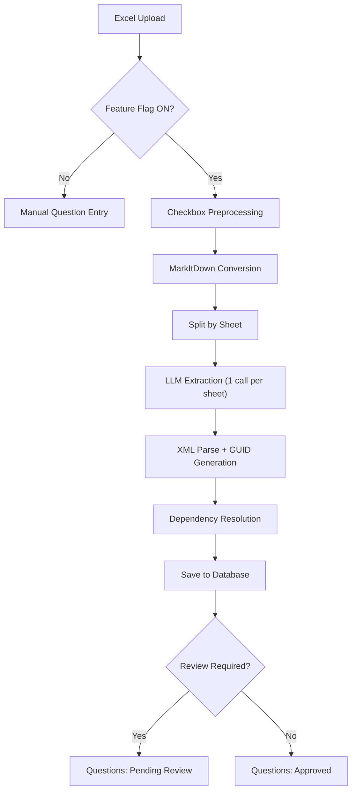

# LLM Question Extraction — Approach Decision Summary

## Context

We evaluated four different approaches for automatically extracting questions, answer options, and dependencies from uploaded Excel survey files using LLMs. After prototyping and testing all four, we selected **Approach 1 (Fully Automatic)** for the initial enterprise implementation.

---

## Approaches Evaluated

| # | Approach | Description | User Input | LLM Calls | Accuracy | Speed |
|---|----------|-------------|------------|-----------|----------|-------|
| **1** | **Fully Automatic** | Converts Excel to Markdown via MarkItDown, processes each sheet independently via LLM, parses structured XML responses | None | 1 per sheet | Good | Medium |
| 2 | User-Guided | User provides column mappings; LLM extracts with hints about where questions and answers live | Column mappings | 1 total | Good (with correct mappings) | Slow |
| 3 | Deterministic + Judge | Parses questions without LLM from specified columns; uses a separate LLM call to validate quality and assign confidence scores | Column mappings | N (validation batches) | N/A (validation only) | Fast |
| 4 | Multi-Step Pipeline | Auto-detects structure via LLM, validates coverage, then extracts per-sheet using only the relevant columns | None | 2 + N per sheet | Best | Slowest |

---

## Why Approach 1

We chose Approach 1 for the following reasons:

1. **Simplicity** — A single conceptual step (convert + extract) with no multi-step LLM coordination. Fewer moving parts means fewer failure modes and easier debugging.

2. **No user input required** — The extraction is fully automatic. Users upload an Excel file and receive extracted questions without needing to understand the file structure or map columns.

3. **Proven accuracy** — In POC testing across ESG questionnaires, vendor surveys, and multi-sheet files (400+ questions, 28 sheets), Approach 1 extracted all questions correctly after implementing per-sheet chunking.

4. **Per-sheet chunking solves token limits** — By splitting the MarkItDown output at sheet boundaries and making one LLM call per sheet, we avoid output token truncation that would occur with a single large prompt.

5. **Fewer LLM calls = lower cost and latency** — Approach 1 makes 1 LLM call per sheet. Approach 4 makes 2 + N calls (structure analysis + coverage validation + extraction per sheet). For a 28-sheet file, that is 28 calls vs 30+.

6. **Extensible architecture** — The service layer uses a Strategy pattern. If accuracy needs improvement for specific file formats, we can add Approach 4 as an alternative strategy and switch via configuration — without changing the database, API, or review workflow.

7. **Checkbox preprocessing covers the gap** — The main weakness of Approach 1 (not seeing checkbox labels hidden in VML drawings) is addressed by a preprocessing step that extracts these labels into a visible column before MarkItDown conversion.

---

## Why Not the Others

| Approach | Reason for not choosing (initially) |
|----------|--------------------------------------|
| **Approach 2** (User-Guided) | Requires user to know and provide column mappings. Not suitable for a fully automated upload flow. |
| **Approach 3** (Deterministic + Judge) | Only validates questions parsed from known columns — does not discover structure. Requires column mappings like Approach 2. |
| **Approach 4** (Multi-Step Pipeline) | Higher accuracy potential but significantly more complex (3 LLM steps, column resolution logic, pandas/openpyxl mismatches). Reserved as an upgrade path if Approach 1 accuracy proves insufficient. |

---

## Detailed Documentation

- **Approach 1 Technical Details**: <!-- TODO: Replace with Confluence page URL -->
  `[Approach 1: Fully Automatic LLM Extraction — Confluence Page](PASTE_CONFLUENCE_URL_HERE)`

- **Migration Plan (POC to Enterprise)**: <!-- TODO: Replace with Confluence page URL -->
  `[LLM Extraction Implementation Plan — Confluence Page](PASTE_CONFLUENCE_URL_HERE)`

---

## Architecture at a Glance

## Extension Path

If extraction accuracy needs improvement for complex file formats, the architecture supports upgrading to Approach 4 via a configuration change (`approach: "pipeline"`). No database or API changes are required. See the migration plan for details.
