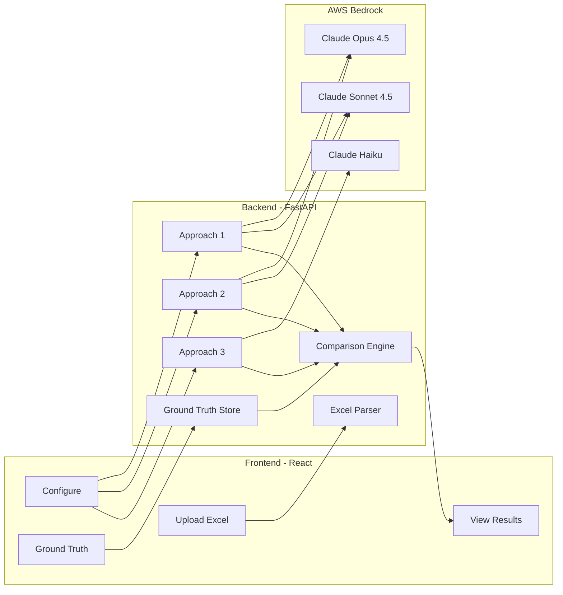

# Question Extraction Testing Framework

A POC for comparing different LLM-based approaches to extract questions from Excel questionnaires.

## Goal

Evaluate and compare three distinct methods for extracting structured question data from Excel files, measuring accuracy, speed, and quality to determine the optimal approach for production use.

## System Architecture



## Flow

1. **Upload** - Drop an Excel file (.xlsx/.xls) or CSV file (.csv)
2. **Select Approach** - Choose extraction method and model
3. **Configure** - Map columns for guided approaches (optional)
4. **Extract** - Run extraction with selected settings
5. **Compare** - View side-by-side results and metrics (including ground truth if available)

## Ground Truth

Create validated question sets ("golden data") to measure extraction accuracy:
- Upload Excel and define expected questions per sheet
- Auto-matches by filename when running extractions
- Compare extracted vs. ground truth side-by-side with precision/recall/F1 metrics

## Extraction Approaches

| Approach | Method | Use Case |
|----------|--------|----------|
| **1. Fully Automatic** | Converts Excel to Markdown, sends entire content to LLM | Quick extraction, no configuration needed |
| **2. User-Guided** | User maps columns, LLM extracts with context hints | Better accuracy when structure is known |
| **3. Deterministic + Judge** | Parses questions without LLM, uses Haiku to validate | Fastest, with quality scoring |

## Quick Start

```bash
# Clone and navigate
cd advanced-question-extraction-poc

# Start both frontend and backend
./start.sh
```

The app opens at `http://localhost:5173`. Backend API runs on `http://localhost:8000`.

### Prerequisites

- Python 3.11+
- Node.js 20+
- AWS credentials configured (for Bedrock access)

## Output

Results are saved to `output/runs/{run_id}/` with:
- Extracted questions per approach
- Comparison metrics
- Prompts used for each extraction

## Documentation

| Document | Description |
|----------|-------------|
| [PROJECT.md](PROJECT.md) | Technical details, dependencies, file structure |
| [Wizard Flow](frontend/src/components/Wizard/EXTRACTION_FLOW.md) | Frontend extraction wizard |
| [Approaches](backend/app/services/APPROACHES.md) | Backend extraction approaches |
| [Output Schema](backend/app/schemas/OUTPUT_SCHEMA.md) | JSON output structure |
| [History Feature](frontend/src/components/History/HISTORY.md) | Historical runs viewer |
| [Ground Truth](frontend/src/components/GroundTruth/GROUND_TRUTH.md) | Ground truth management |
