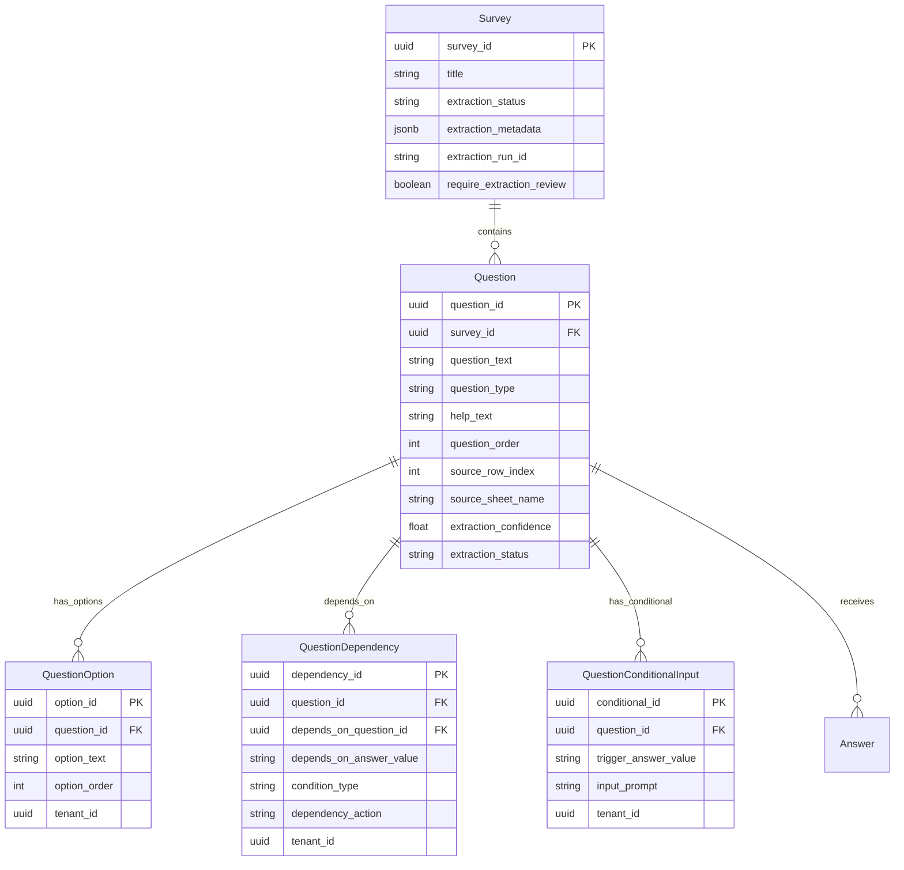

# Ticket: Database Migration and Model Classes

## Title

**Create Database Migrations and Model Classes for LLM Question Extraction**

---

## Type

Sub-task

## Priority

High

## Labels

- `backend`
- `database`
- `migration`

## Parent Ticket

LLM Question Extraction (see `JIRA_LLM_QUESTION_EXTRACTION.md`)

---

## Description

Create the Alembic database migrations and corresponding Python model classes needed to support the LLM question extraction feature. This includes new tables for question options, dependencies, and conditional inputs, as well as new columns on the existing `questions` and `surveys` tables.

This ticket is **scoped strictly to the database and model layers**. No repositories, services, or API endpoints are included.

### What to Create

**New tables:**
- `question_options` — predefined answer choices for a question
- `question_dependencies` — conditional logic between questions (e.g., show question B only if question A is answered "No")
- `question_conditional_inputs` — additional input prompts triggered by specific answers (e.g., "Yes, please provide detail")

**New enum type:**
- `question_type_enum` — PostgreSQL enum for question types

**Altered tables:**
- `questions` — add extraction-related columns (help_text, source tracking, confidence, status)
- `surveys` — add extraction status tracking columns

**Python model classes:**
- `QuestionType` enum
- `QuestionOption` model
- `QuestionDependency` model
- `QuestionConditionalInput` model
- Updated `Question` model (new fields)
- Updated `Survey` model (new fields)

### Target State ER Diagram

---

## Acceptance Criteria

### Migrations

- [ ] Migration creates `question_type_enum` PostgreSQL enum type with values: `open_ended`, `single_choice`, `multiple_choice`, `yes_no`, `numeric`, `integer`, `decimal`
- [ ] Migration creates `question_options` table with columns:
  - `option_id` (UUID, PK)
  - `question_id` (UUID, FK to questions, NOT NULL)
  - `option_text` (TEXT, NOT NULL)
  - `option_order` (INT, NOT NULL)
  - `tenant_id` (UUID, NOT NULL)
  - `created_at`, `updated_at` timestamps
- [ ] Migration creates `question_dependencies` table with columns:
  - `dependency_id` (UUID, PK)
  - `question_id` (UUID, FK to questions, NOT NULL)
  - `depends_on_question_id` (UUID, FK to questions, NOT NULL)
  - `depends_on_answer_value` (TEXT)
  - `condition_type` (TEXT, default `'equals'`)
  - `dependency_action` (TEXT, NOT NULL)
  - `tenant_id` (UUID, NOT NULL)
  - `created_at`, `updated_at` timestamps
- [ ] Migration creates `question_conditional_inputs` table with columns:
  - `conditional_id` (UUID, PK)
  - `question_id` (UUID, FK to questions, NOT NULL)
  - `trigger_answer_value` (TEXT, NOT NULL)
  - `input_prompt` (TEXT, NOT NULL)
  - `tenant_id` (UUID, NOT NULL)
  - `created_at`, `updated_at` timestamps
- [ ] Migration adds columns to `questions` table:
  - `help_text` (TEXT, nullable)
  - `source_row_index` (INT, nullable)
  - `source_sheet_name` (TEXT, nullable)
  - `extraction_confidence` (FLOAT, nullable)
  - `extraction_status` (TEXT, default `'approved'`)
- [ ] Migration adds columns to `surveys` table:
  - `extraction_status` (TEXT, default `'not_started'`)
  - `extraction_metadata` (JSONB, nullable)
  - `extraction_run_id` (UUID, nullable)
  - `require_extraction_review` (BOOL, default `true`)
- [ ] All migrations are reversible (down migrations work correctly)
- [ ] Foreign key columns have appropriate indexes
- [ ] Schema is forward-compatible with Approach 4 (no changes will be needed on upgrade)

### Model Classes

- [ ] `QuestionType` enum created with values: `open_ended`, `single_choice`, `multiple_choice`, `yes_no`, `numeric`, `integer`, `decimal`
- [ ] `QuestionOption` model created with fields: `option_id`, `question_id`, `option_text`, `option_order`, `tenant_id`
- [ ] `QuestionDependency` model created with fields: `dependency_id`, `question_id`, `depends_on_question_id`, `depends_on_answer_value`, `condition_type`, `dependency_action`, `tenant_id`
- [ ] `QuestionConditionalInput` model created with fields: `conditional_id`, `question_id`, `trigger_answer_value`, `input_prompt`, `tenant_id`
- [ ] `Question` model updated with new fields: `help_text`, `source_row_index`, `source_sheet_name`, `extraction_confidence`, `extraction_status`
- [ ] `Survey` model updated with new fields: `extraction_status`, `extraction_metadata`, `extraction_run_id`, `require_extraction_review`
- [ ] Unit tests for model creation and field validation

### Out of Scope

- Repositories (CRUD operations) — separate ticket
- Services, orchestrator, extraction logic — separate ticket
- API endpoints — separate ticket
- Feature flag setup — see `TICKET_FEATURE_FLAG.md`
- Configuration file — see `TICKET_EXTRACTION_CONFIG.md`

---

## Migration Order

| Order | Migration Name | Description |
|-------|---------------|-------------|
| 1 | `add_question_type_enum` | Create `question_type_enum` PostgreSQL enum |
| 2 | `create_question_options_table` | New table for answer choices |
| 3 | `create_question_dependencies_table` | New table for conditional logic |
| 4 | `create_question_conditional_inputs_table` | New table for "if yes, provide detail" |
| 5 | `alter_questions_add_extraction_fields` | Add help_text, source tracking, confidence to questions |
| 6 | `alter_surveys_add_extraction_fields` | Add extraction_status, metadata to surveys |

---

## Technical Notes

- Follow existing project patterns for model base classes
- All new tables require `tenant_id` for multi-tenant isolation
- The `question_type_enum` replaces the current generic string `question_type` on the `questions` table
- `extraction_status` on questions uses string values: `pending_review`, `approved`, `rejected`
- `extraction_status` on surveys uses string values: `not_started`, `in_progress`, `completed`, `failed`, `partial`
- All UUID primary keys should use `uuid_generate_v4()` as default

---

## Related Documents

- `LLM_EXTRACTION_IMPLEMENTATION_PLAN.md` — Full implementation plan (see Database Migrations and New Database Models sections)
- `JIRA_LLM_QUESTION_EXTRACTION.md` — Parent Jira ticket
- `backend/app/services/APPROACH_1.md` — Approach 1 pipeline documentation
