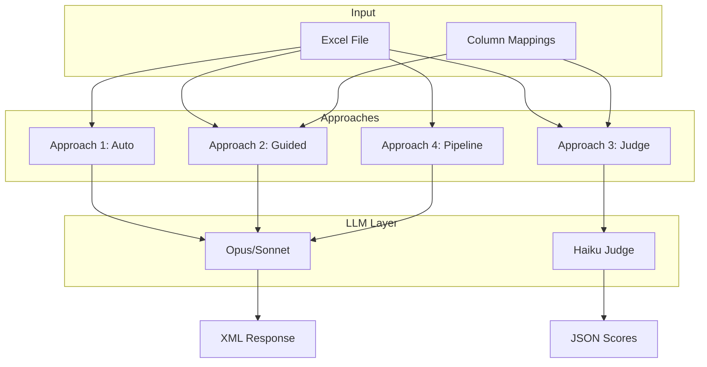
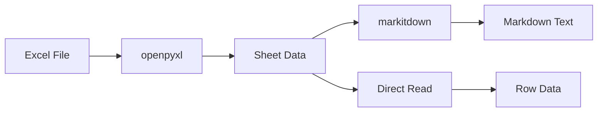

# Extraction Approaches

This document details the four extraction approaches implemented in the backend.

## Overview



## Approach 1: Fully Automatic (`approach_auto.py`)

**No user input required. Now with rich output similar to Approach 4.**

### Process

1. Convert Excel to Markdown using `markitdown`
2. Send entire content to LLM with extraction prompt (rich format)
3. Parse XML response with two-pass GUID generation and dependency resolution
4. Return questions with dependencies, help text, and conditional inputs

### When to Use

- Quick baseline extraction
- Unknown file structure
- First-time exploration of a questionnaire
- Need dependency detection without structure analysis steps

### Key Features (Updated)

- **Dependencies detected**: Follow-up questions are linked via `depends_on` relationships
- **Help text extraction**: Instructions/comments separated from question text
- **Conditional inputs**: Extracts "please provide detail" prompts for specific answers
- **Question IDs**: GUIDs generated for stable dependency references
- **Sequence-based dependencies**: Uses `seq` numbers resolved to GUIDs

### XML Output Format

```xml
<questions>
  <q type="yes_no" seq="1">
    <text>Do you have sustainability certifications?</text>
    <help_text></help_text>
    <answers><option>Yes</option><option>No</option></answers>
    <conditional_inputs><input answer="Yes">please provide certification details</input></conditional_inputs>
    <dependencies></dependencies>
  </q>
  <q type="open_ended" seq="2">
    <text>If you do not have certifications, please explain why.</text>
    <help_text></help_text>
    <answers></answers>
    <dependencies>
      <depends_on question_seq="1" answer_value="No" action="show"/>
    </dependencies>
  </q>
</questions>
```

### Follow-up Question Detection

Automatically detects follow-up questions based on text patterns:
- "If you can not...", "If no...", "If not..."
- "Please explain...", "Please detail...", "Please provide..."
- "If applicable..."

When detected, creates a dependency linking the follow-up to the previous question with `action="show"`.

### Intermediate Results Saved

When `run_id` is provided, saves to `intermediate_results/`:
- `excel_as_markdown.md` - Excel converted to Markdown
- `extraction_prompt.txt` - Full prompt sent to LLM
- `extraction_response.xml` - Raw LLM response
- `parsed_questions.json` - Final parsed questions

### Output Metrics

| Metric | Description |
|--------|-------------|
| `extraction_count` | Number of questions found |
| `llm_time_ms` | Time spent in LLM call |
| `total_time_ms` | Total processing time |
| `tokens_input` | Approximate input tokens |
| `tokens_output` | Approximate output tokens |
| `show_dependencies_count` | Questions with "show" dependencies |
| `skip_dependencies_count` | Questions with "skip" dependencies |

### Per-Question Fields

| Field | Description |
|-------|-------------|
| `question_id` | Unique GUID for this question |
| `question_text` | Main question text |
| `help_text` | Additional instructions/comments |
| `question_type` | Detected type (yes_no, single_choice, etc.) |
| `answers` | List of answer options |
| `conditional_inputs` | Map of answer values to additional prompts |
| `dependencies` | List of question dependencies |

---

## Approach 2: User-Guided (`approach_guided.py`)

**User provides column mappings and expected question types.**

### Process

1. Count expected rows from user-specified columns (deterministic)
2. Convert Excel to Markdown
3. Build dynamic prompt with user context (column hints, expected count)
4. Call LLM with enhanced context
5. Calculate accuracy: `extraction_count / expected_count`

### When to Use

- Structure is known (which columns contain questions)
- Need accuracy measurement
- Want LLM to focus on specific columns

### Column Mapping Structure

```python
class ColumnMapping:
    sheet_name: str
    question_column: str       # Required
    answer_column: str | None  # Optional
    type_column: str | None    # Optional
    question_types: list[QuestionType]
    start_row: int             # Default: 2
    end_row: int | None        # Optional
```

### Prompt Template

```
Extract ALL questions from this survey content.

USER-PROVIDED STRUCTURE INFORMATION:

Sheet: {sheet_name}
  - Question column: {question_column}
  - Answer column: {answer_column}
  - Data starts at row: {start_row}

EXPECTED QUESTION TYPES: {types}

EXPECTED COUNT: Approximately {expected_count} questions should be extracted.

EXTRACTION RULES

Focus on the columns specified above. The question text is in the 
"{question_column}" column.

EXTRACT EVERY ROW: Each row in the question column represents one 
question. Extract all {expected_count} rows.

CONTENT:
{content}

OUTPUT FORMAT:
<questions>
  <q type="open_ended">Full question text</q>
  <q type="single_choice">Question? (Option A|Option B)</q>
</questions>

IMPORTANT: Extract exactly {expected_count} questions if possible.
Return ONLY the XML.
```

### Output Metrics

| Metric | Description |
|--------|-------------|
| `extraction_count` | Number of questions found |
| `expected_count` | Rows counted in specified columns |
| `accuracy` | `extraction_count / expected_count` |
| `llm_time_ms` | Time spent in LLM call |
| `total_time_ms` | Total processing time |

---

## Approach 3: Deterministic + Judge (`approach_judge.py`)

**No LLM for extraction. LLM only validates quality.**

### Process

1. Parse rows directly from specified columns (no LLM)
2. Run Haiku judge model on batches of 10 questions
3. Assign confidence scores and validity flags
4. Return questions with quality metadata

### When to Use

- Speed is critical
- Need confidence scores for filtering
- Structure is well-defined
- Want to validate extraction quality

### Judge Prompt Template

```
You are a question quality validator. For each item below, assess:
1. Is this a valid survey question? (not a comment, instruction, or header)
2. How confident are you that this is a properly formatted question? (0.0-1.0)

Items to evaluate:
1. {question_text}
2. {question_text}
...

Respond in JSON format:
{
  "evaluations": [
    {"item": 1, "is_valid": true, "confidence": 0.95, "reason": "Clear question with options"},
    {"item": 2, "is_valid": false, "confidence": 0.2, "reason": "This is a section header, not a question"}
  ]
}

Evaluate ALL {count} items. Return ONLY the JSON.
```

### Output Metrics

| Metric | Description |
|--------|-------------|
| `extraction_count` | Number of rows parsed |
| `expected_count` | Same as extraction_count (deterministic) |
| `accuracy` | Always 1.0 (deterministic) |
| `avg_confidence` | Average judge confidence score |
| `low_confidence_count` | Items below threshold (0.7) |
| `llm_time_ms` | Time spent in judge calls |
| `total_time_ms` | Total processing time |

### Per-Question Fields

| Field | Description |
|-------|-------------|
| `confidence` | Judge confidence (0.0-1.0) |
| `is_valid_question` | Judge determination |
| `row_index` | Original Excel row number |
| `sheet_name` | Source sheet |

---

## Approach 4: Multi-Step Pipeline (`approach_pipeline.py`)

**Automatic structure detection + LLM extraction with context.**

### Process

1. **Structure Analysis**: LLM analyzes Excel to identify question/answer columns
2. **Coverage Validation**: Verify structure spans the file, identify question rows
3. **Question Extraction**: Extract questions with rich context (answer options, dependencies)
4. **Normalization**: Convert XML to `ExtractedQuestion` objects

### When to Use

- Unknown file structure (like Approach 1) but need better accuracy
- Need dependency detection between questions
- Want automatic type detection with context-aware extraction

### Key Features

- **Auto-detects columns**: No user mapping required
- **Gap tolerance**: Handles empty rows between answer options (up to 5 rows)
- **Follow-up detection**: Automatically identifies follow-up questions and creates dependencies
- **Help text separation**: Extracts instructions/comments into `help_text` field

### Follow-up Question Detection

Automatically detects follow-up questions based on text patterns:
- "If you can not...", "If no...", "If not..."
- "Please explain...", "Please detail...", "Please provide..."

When detected, creates a dependency linking the follow-up to the previous question with `action="show"`.

### Output Metrics

| Metric | Description |
|--------|-------------|
| `extraction_count` | Number of questions found |
| `structure_analysis_time_ms` | Time for Step 1 |
| `coverage_validation_time_ms` | Time for Step 2 |
| `question_extraction_time_ms` | Time for Step 3 |
| `normalization_time_ms` | Time for Step 4 |
| `total_time_ms` | Total processing time |

### Per-Question Fields

| Field | Description |
|-------|-------------|
| `question_text` | Main question text |
| `help_text` | Additional instructions/comments |
| `question_type` | Detected type (yes_no, single_choice, etc.) |
| `answers` | List of answer options |
| `dependencies` | List of question dependencies |
| `row_index` | Original Excel row number |
| `sheet_name` | Source sheet |

See [APPROACH_4.md](APPROACH_4.md) for detailed documentation.

---

## Excel Parsing (`excel_parser.py`)

The `ExcelParser` service handles all Excel file operations.

### Methods

| Method | Description |
|--------|-------------|
| `convert_to_markdown()` | Converts Excel to Markdown for LLM |
| `count_rows_in_columns()` | Counts non-empty rows in specified columns |
| `extract_rows_by_columns()` | Extracts row data deterministically |
| `get_metadata()` | Returns sheet names, columns, sample data |

### Sheet Processing



---

## Response Parsing

### Approach 1 (Rich Format)

Approach 1 now uses a rich XML format with nested elements:

```xml
<questions>
  <q type="yes_no" seq="1">
    <text>Do you have certifications?</text>
    <help_text></help_text>
    <answers><option>Yes</option><option>No</option></answers>
    <conditional_inputs><input answer="Yes">provide details</input></conditional_inputs>
    <dependencies></dependencies>
  </q>
</questions>
```

**Parsing logic** (`_parse_response` in approach_auto.py):
1. Find `<questions>` tags, handle incomplete XML
2. **First pass**: Create questions with GUIDs, build seq->GUID mapping
3. Parse `<text>`, `<help_text>`, `<answers>/<option>`, `<conditional_inputs>`, `<dependencies>`
4. **Second pass**: Resolve dependency references from seq numbers to GUIDs
5. Fallback: Also handles legacy format with embedded answers in parentheses

### Approach 2 (Legacy Format)

Approach 2 still uses the simpler format with embedded answers:

```xml
<questions>
  <q type="open_ended">What is your name?</q>
  <q type="single_choice">Gender? (Male|Female|Other)</q>
  <q type="grouped_question">Rate the following: Service quality</q>
</questions>
```

**Parsing logic**:
1. Find `<questions>` tags
2. Handle incomplete XML (recovery)
3. Parse with BeautifulSoup
4. Extract embedded answers from parentheses
5. Map type strings to `QuestionType` enum

---

## Model Selection

Models are selected in `config.py`:

```python
# Extraction models (Approaches 1 & 2)
bedrock_opus_model_id = "us.anthropic.claude-opus-4-5-20251101-v1:0"
bedrock_sonnet_model_id = "us.anthropic.claude-sonnet-4-20250514-v1:0"

# Judge model (Approach 3 only)
bedrock_judge_model_id = "global.anthropic.claude-3-haiku-20240307-v1:0"
```

**Model parameters:**

| Setting | Extraction | Judge |
|---------|------------|-------|
| `max_tokens` | 24,576 | 1,024 |
| `temperature` | 0.1 | 0.0 |

---

## Comparison Summary

| Aspect | Approach 1 | Approach 2 | Approach 3 | Approach 4 |
|--------|------------|------------|------------|------------|
| **LLM for extraction** | Yes | Yes | No | Yes |
| **User input required** | No | Yes | Yes | No |
| **Accuracy metric** | No | Yes | N/A | No |
| **Confidence scores** | No | No | Yes | No |
| **Speed** | Slow | Slow | Fast | Medium |
| **Model used** | Opus/Sonnet | Opus/Sonnet | Haiku | Opus/Sonnet |
| **Dependencies detected** | Yes | No | No | Yes |
| **Follow-up detection** | Yes | No | No | Yes |
| **Help text extraction** | Yes | No | No | Yes |
| **Conditional inputs** | Yes | No | No | Yes |
| **Question IDs (GUIDs)** | Yes | No | No | Yes |
| **Intermediate results saved** | Yes | No | No | Yes |
| **Best for** | Quick extraction with dependencies | Known structure | Validation | Complex multi-step extraction |
