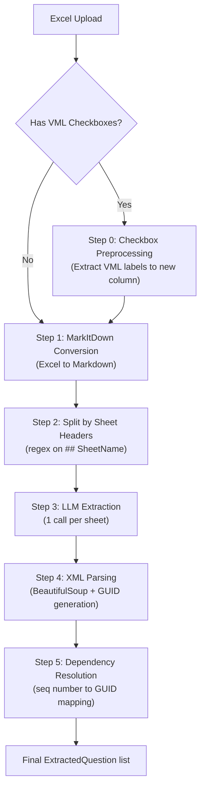

# Approach 1: Fully Automatic LLM Extraction

## Overview

Approach 1 is a fully automatic extraction pipeline that requires **no user input**. It converts an Excel file to Markdown, optionally preprocesses checkbox labels from VML drawings, splits the result by sheet, and sends each sheet independently to an LLM for question extraction. The LLM returns structured XML which is parsed, assigned GUIDs, and has dependencies resolved in a two-pass normalization step.

This is the **recommended starting approach** for enterprise integration. Its architecture is designed so that it can be extended or refactored to Approach 4 (multi-step pipeline with structure analysis) if higher accuracy is needed for complex questionnaire formats.

---

## Pipeline Flow



---

## Step 0: Checkbox Label Preprocessing

**Purpose**: Make checkbox labels visible to MarkItDown. Excel checkboxes store their display labels inside VML (Vector Markup Language) drawings embedded in the `.xlsx` ZIP archive, not in regular cell values. MarkItDown cannot read these VML drawings, so the labels are invisible to the LLM.

**When to apply**: Only for `.xlsx` files that contain VML drawings with `ObjectType="Checkbox"`.

### Why This Is Needed

Consider an ESG survey where column F contains checkboxes with TRUE/FALSE values, and each checkbox has a human-readable label like "Environmental certifications (ISO 50001, ISO 14001, EMAS)". Without preprocessing:

| What MarkItDown sees | What the actual label is |
|----------------------|--------------------------|
| `TRUE` | Environmental certifications (ISO 50001) |
| `FALSE` | Labor and human rights certifications |
| `TRUE` | Business ethics certification(s) |

The LLM would only see TRUE/FALSE and could not extract the answer option text.

### How It Works

The preprocessor operates on the raw `.xlsx` ZIP archive at the XML level:

**1. Extract checkbox data from VML**

```
.xlsx (ZIP archive)
└── xl/
    └── drawings/
        └── vmlDrawing1.xml    ← Contains checkbox shapes
```

Each checkbox shape in VML contains:
- A `<font>` tag with the human-readable label text
- An `<x:FmlaLink>` tag with the linked cell reference (e.g., `$F$30`)

```xml
<v:shape ... ObjectType="Checkbox">
  <v:textbox>
    <div>
      <font face="Calibri" size="220" color="#000000">
        Environmental certifications (ISO 50001, ISO 14001, EMAS)
      </font>
    </div>
  </v:textbox>
  <x:ClientData ObjectType="Checkbox">
    <x:FmlaLink>$F$30</x:FmlaLink>
  </x:ClientData>
</v:shape>
```

The preprocessing logic:
1. Opens the `.xlsx` as a ZIP archive
2. Finds all `vmlDrawing*.xml` files
3. For each file, finds `<v:shape>` elements with `ObjectType="Checkbox"`
4. Extracts the label from `<font>` and the linked cell from `<x:FmlaLink>`
5. Maps each label to its row number (parsed from the cell reference)

**2. Find the target sheet XML**

Uses `xl/workbook.xml` and `xl/_rels/workbook.xml.rels` to resolve the sheet name to its physical XML file path (e.g., `xl/worksheets/sheet1.xml`).

**3. Write labels to a new column**

- Finds the highest column letter already in use in the sheet XML
- Appends labels to the next available column (e.g., column P)
- Adds a header cell with the text "Checkbox Alt texts" in the header row
- For each checkbox, creates an inline string cell: `<c r="P30" t="inlineStr"><is><t>label text</t></is></c>`
- XML-escapes special characters (`&`, `<`, `>`, `"`)

**4. Write back to ZIP**

Creates a temporary `.xlsx` file, copies all original ZIP entries except the modified sheet XML, then replaces the original file.

### Result After Preprocessing

MarkItDown now produces markdown like:

```markdown
| Question | Company Response | Checkbox Alt texts |
| --- | --- | --- |
| Are you subject to regulation? | TRUE | Yes, we are regulated |
| - | FALSE | No, we are not regulated |
| Which policies do you have? | TRUE | Environmental policy |
| - | TRUE | Health and safety policy |
| - | FALSE | Anti-bribery policy |
```

The LLM can now see both the checkbox state (TRUE/FALSE) and the human-readable label, enabling correct extraction of multiple-choice questions.

### Enterprise Implementation Notes

The POC implementation ([checkbox_label_poc.py](../../checkbox_label_poc.py)) targets a single hardcoded sheet and row range. The enterprise version should:
- Iterate over **all sheets** in the workbook, not just one
- Remove hardcoded row range filters — process all checkboxes found
- Operate on a **temporary copy** of the uploaded file (never modify the original)
- Return the temp file path for MarkItDown to consume
- Be idempotent: if no VML checkboxes are found, return the original file path unchanged
- Handle edge cases: corrupted VML, missing `<font>` tags, multi-sheet checkbox files

---

## Step 1: MarkItDown Conversion

**Purpose**: Convert the entire Excel file (or the checkbox-preprocessed copy) to a single Markdown string.

**Library**: `markitdown` (Python package)

### Process

1. Call `markitdown.convert(file_path)` on the Excel file
2. The library reads all sheets and produces Markdown with `## SheetName` headers separating each sheet
3. Each sheet's data is rendered as a Markdown table
4. Post-processing: Replace `NaN` values with `-` for cleaner LLM input

### Output Format

```markdown
## Sheet1

| Column A | Column B | Column C |
| --- | --- | --- |
| Question 1 | Yes | ... |
| Question 2 | No | ... |

## Sheet2

| Column A | Column B |
| --- | --- |
| Question 3 | ... |
```

### CSV Handling

For CSV files, a custom converter builds the Markdown table directly from the CSV rows (since MarkItDown is Excel-focused). The output uses `# FileName` as the header instead of `## SheetName`.

### Saved Files

- `intermediate_results/excel_as_markdown.md` — Full MarkItDown output for debugging

---

## Step 2: Per-Sheet Splitting

**Purpose**: Split the single Markdown string into independent per-sheet chunks. This prevents LLM output token truncation on large multi-sheet files.

### Why Per-Sheet Splitting?

The LLM has a maximum output token limit (32,768 tokens for Claude). A 28-sheet Excel file processed as a single prompt would require the LLM to output all questions in one response — easily exceeding the limit. When the limit is hit, the XML output is truncated mid-question, causing data loss.

By splitting into per-sheet chunks and making one LLM call per sheet, each response stays well within the output limit.

### Splitting Logic

```python
# Regex pattern matching MarkItDown's sheet headers
sheet_pattern = re.compile(r'^## (.+)$', re.MULTILINE)
matches = list(sheet_pattern.finditer(markdown_text))
```

**Rules:**
- If no `## SheetName` headers are found (single-sheet file or CSV), return the entire content as one chunk with `sheet_name = "Sheet1"`
- Otherwise, split at each `## SheetName` boundary
- Each chunk contains only the content between two consecutive headers
- Empty sheets (no content after the header) are skipped

**Output**: A list of `{"sheet_name": str, "content": str}` dictionaries.

**Example**: A 28-sheet Excel file produces 28 chunks, each processed by a separate LLM call.

---

## Step 3: LLM Extraction

**Purpose**: Send each sheet's Markdown content to the LLM and receive structured XML with extracted questions.

**Model**: Claude Sonnet 4.5 (default) or Claude Opus 4.5
**Max Tokens**: 32,768
**Temperature**: 0.1
**Response Format**: XML

### Prompt Template

Each sheet receives its own prompt with the sheet name injected for context:

```
Extract ALL questions from the sheet '{sheet_name}' from this survey content.

EXTRACTION RULES

1. ANALYZE THE STRUCTURE: Identify which columns/sections contain questions,
   answer options, and instructions.

2. EXTRACT EVERY QUESTION FULLY: Extract each question completely. This includes:
   - Interrogative sentences (e.g., "How satisfied are you...")
   - Imperative instructions (e.g., "List the main reasons...")
   - Any request for information

3. SEPARATE QUESTION TEXT FROM INSTRUCTIONS:
   - Put the actual question in <text>
   - Put instructions, comments, or help text in <help_text>

4. EXTRACT ALL ANSWER OPTIONS:
   - Put each answer option in a separate <option> tag within <answers>
   - Do NOT embed answers in the question text

5. DETECT CONDITIONAL INPUTS:
   - If an answer option requires additional input
     (e.g., "Yes (please provide detail)"), extract the instruction
   - Put in <conditional_inputs> with the answer value as attribute

6. DETECT FOLLOW-UP QUESTIONS AND DEPENDENCIES:
   - Text patterns indicating follow-ups:
     "If you can not...", "If no...", "If not...",
     "Please explain...", "Please detail...", "If applicable..."
   - When detected, create a dependency to the PREVIOUS question
     using its seq number
   - Dependency actions:
     - "show": Question appears only if condition is met
     - "skip": Question is skipped if condition is met

7. QUESTION TYPES:
   - yes_no: EXACTLY 2 options that are "Yes"/"No" or "True"/"False"
   - single_choice: Multiple options but only one can be selected
   - multiple_choice: Multiple options and multiple can be selected
   - open_ended: No predefined answer options, free text input
   - numeric: Number input (any number)
   - integer: Whole numbers only
   - decimal: Decimal numbers
   - grouped_question: Parent question with subquestions

8. SEQUENCE NUMBERS:
   - Assign sequential numbers (seq="1", seq="2", ...) to each question
   - Use these for dependency references

CONTENT:
{sheet_content}

OUTPUT FORMAT:
<questions>
  <q type="yes_no" seq="1">
    <text>Do you have sustainability certifications?</text>
    <help_text></help_text>
    <answers><option>Yes</option><option>No</option></answers>
    <conditional_inputs>
      <input answer="Yes">please provide certification details</input>
    </conditional_inputs>
    <dependencies></dependencies>
  </q>
  <q type="open_ended" seq="2">
    <text>If you do not have certifications, please explain why.</text>
    <help_text></help_text>
    <answers></answers>
    <dependencies>
      <depends_on question_seq="1" answer_value="No" action="show"/>
    </dependencies>
  </q>
</questions>

RULES:
- Assign sequential seq numbers starting from 1
- Put question text in <text>, NOT as element content
- Put each answer option in separate <option> tags
- For grouped_question: combine as "Parent: Sub question" in <text>
- Always include all XML elements even if empty
- Return ONLY the XML, nothing else

Extract ALL questions. Return ONLY the XML.
```

### Output XML Format

```xml
<questions>
  <q type="multiple_choice" seq="4">
    <text>Does your company have any of the following certifications?</text>
    <help_text>Select all that apply</help_text>
    <answers>
      <option>Environmental certifications (ISO 50001, ISO 14001, EMAS)</option>
      <option>Labor and human rights certifications</option>
      <option>Business ethics certification(s)</option>
    </answers>
    <conditional_inputs>
      <input answer="Yes">please provide detail</input>
    </conditional_inputs>
    <dependencies>
      <depends_on question_seq="3" answer_value="Yes" action="show"/>
    </dependencies>
  </q>
</questions>
```

### Follow-up Question Detection

The LLM automatically detects follow-up questions based on text patterns and creates dependency references:

**Trigger patterns:**
- "If you can not...", "If no...", "If not..."
- "If not applicable...", "If applicable..."
- "Please explain...", "Please detail...", "Please provide..."

**Example:**
```
seq="5": "Can you confirm you meet this requirement?"  → yes_no
seq="6": "If you can not reach this requirement, please detail here."  → open_ended
         → dependency: depends_on question_seq="5" answer_value="No" action="show"
```

### Saved Files (Per Sheet)

- `intermediate_results/approach_1_sheet_{N}_prompt.txt` — Prompt sent to LLM
- `intermediate_results/approach_1_sheet_{N}_response.xml` — Raw XML response

---

## Step 4: XML Parsing + GUID Generation

**Purpose**: Parse each sheet's XML response into `ExtractedQuestion` Python objects, assign unique GUIDs, and build a mapping for dependency resolution.

**Library**: BeautifulSoup with `xml` parser

### Two-Pass Approach

The parser uses a two-pass approach to handle forward references in dependencies:

**Pass 1: Create questions with GUIDs**

For each `<q>` element in the XML:
1. Generate a unique UUID (`question_id`)
2. Store `seq -> question_id` in a lookup map
3. Extract question text from `<text>` tag
4. Map the `type` attribute to a `QuestionType` enum value
5. Extract `<help_text>` content (nullable)
6. Extract `<answers>/<option>` elements into a list
7. Extract `<conditional_inputs>/<input>` into a dict (`{answer_value: prompt_text}`)
8. Store raw dependency data (seq references) for second pass

**Pass 2: Resolve dependencies**

For each question that has `<dependencies>/<depends_on>` elements:
1. Look up the target question's GUID using the seq-to-GUID map
2. Create `QuestionDependency` objects with resolved GUID references
3. Attach dependencies to the question

### Type Mapping

| XML `type` attribute | Python `QuestionType` |
|----------------------|----------------------|
| `open_ended` | `QuestionType.OPEN_ENDED` |
| `single_choice` | `QuestionType.SINGLE_CHOICE` |
| `multiple_choice` | `QuestionType.MULTIPLE_CHOICE` |
| `yes_no` | `QuestionType.YES_NO` |
| `numeric` | `QuestionType.NUMERIC` |
| `integer` | `QuestionType.INTEGER` |
| `decimal` | `QuestionType.DECIMAL` |
| `grouped_question` | `QuestionType.GROUPED_QUESTION` |

### Sheet Name Injection

Each question receives the `sheet_name` from the chunk that produced it. This is set during parsing, not by the LLM, ensuring accuracy.

### Incomplete XML Recovery

If the LLM response is truncated (missing `</questions>` closing tag), the parser appends `</questions>` and attempts recovery. Questions parsed before the truncation point are preserved.

---

## Step 5: Dependency Resolution

**Purpose**: Convert sequential reference numbers (`question_seq="3"`) into stable GUIDs that are decoupled from the extraction order.

### Why GUIDs?

| Aspect | Seq References | GUIDs |
|--------|---------------|-------|
| **Stability** | Fragile — change if questions reordered | Stable — always valid |
| **Frontend** | Must maintain ordering context | Direct ID lookup |
| **Database** | Extra mapping layer needed | Maps directly to PK |
| **Cross-run** | Meaningless across extractions | Unique globally |

### Resolution Logic

```python
# Built during Pass 1
seq_to_guid = {
    "1": "a1b2c3d4-...",
    "2": "e5f6g7h8-...",
    "3": "i9j0k1l2-...",
}

# During Pass 2
for dependency in raw_dependencies:
    # "question_seq=3" → "i9j0k1l2-..."
    dependency.depends_on_question_id = seq_to_guid.get(
        dependency.raw_seq, dependency.raw_seq  # fallback to raw if not found
    )
```

### Scope

Dependencies are resolved **within the same sheet**. Cross-sheet dependencies are not currently supported. Each sheet's seq numbers start from 1 and are independent.

---

## Question Types Supported

| Type | Description | Answer Options |
|------|-------------|----------------|
| `open_ended` | Free text input | None |
| `single_choice` | Select one from list | Multiple options |
| `multiple_choice` | Select many from list (checkboxes) | Multiple options |
| `yes_no` | Binary Yes/No or True/False | Exactly 2 |
| `numeric` | Any number | None |
| `integer` | Whole numbers only | None |
| `decimal` | Decimal numbers | None |
| `grouped_question` | Parent with subquestions | Options for sub-items |

---

## Final Output

### ExtractedQuestion Object

```python
ExtractedQuestion(
    question_id="a1b2c3d4-e5f6-7890-abcd-ef1234567890",  # Unique GUID
    question_text="Does your company have sustainability certifications?",
    question_type=QuestionType.YES_NO,
    answers=["Yes", "No"],
    help_text="Include ISO and other standards",
    conditional_inputs={"Yes": "please provide certification details"},
    dependencies=[
        QuestionDependency(
            depends_on_question_id="f9e8d7c6-b5a4-3210-fedc-ba0987654321",
            depends_on_answer_value="Yes",
            condition_type="equals",
            dependency_action="show",
            original_text=None,
        )
    ],
    sheet_name="ESG DDQ",
)
```

### ExtractionResult

```json
{
  "approach": 1,
  "success": true,
  "questions": [ ... ],
  "metrics": {
    "extraction_count": 421,
    "llm_time_ms": 85000,
    "total_time_ms": 92000,
    "total_llm_calls": 28,
    "tokens_input": 450000,
    "tokens_output": 120000,
    "show_dependencies_count": 35,
    "skip_dependencies_count": 2
  }
}
```

---

## Metrics

| Metric | Description |
|--------|-------------|
| `extraction_count` | Total number of questions extracted across all sheets |
| `total_llm_calls` | Number of per-sheet LLM calls (equals number of non-empty sheets) |
| `llm_time_ms` | Total wall-clock time spent in LLM calls |
| `total_time_ms` | Total pipeline duration (including preprocessing and parsing) |
| `tokens_input` | Approximate total input tokens (prompt characters / 4) |
| `tokens_output` | Approximate total output tokens (response characters / 4) |
| `show_dependencies_count` | Questions with `action="show"` dependencies |
| `skip_dependencies_count` | Questions with `action="skip"` dependencies |

---

## Intermediate Results Directory Structure

```
output/runs/{run_id}/
├── metadata.json                                    # Run configuration
├── approach_1_result.json                           # Final extraction result
└── intermediate_results/
    ├── excel_as_markdown.md                         # Full MarkItDown output
    ├── approach_1_sheet_1_prompt.txt                # Prompt for sheet 1
    ├── approach_1_sheet_1_response.xml              # LLM response for sheet 1
    ├── approach_1_sheet_2_prompt.txt                # Prompt for sheet 2
    ├── approach_1_sheet_2_response.xml              # LLM response for sheet 2
    ├── ...                                          # One pair per sheet
    ├── approach_1_sheet_N_prompt.txt                # Prompt for sheet N
    ├── approach_1_sheet_N_response.xml              # LLM response for sheet N
    ├── approach_1_parsed_questions.json             # Combined parsed questions (all sheets)
    └── error.txt                                    # Error details (only on failure)
```

> **Note**: Each sheet gets its own numbered prompt and response file. A 28-sheet Excel file produces 28 prompt/response pairs. All prompts contain the actual substituted dynamic values (sheet content, sheet name).

---

## Error Handling

| Scenario | Handling |
|----------|----------|
| **MarkItDown returns empty** | Return `ExtractionResult(success=False, error="Failed to convert...")` |
| **LLM timeout on one sheet** | Bedrock client retries up to 3 times (adaptive mode), then exception propagates |
| **Incomplete XML** (truncated response) | Parser appends `</questions>` and recovers questions before truncation point |
| **No `<questions>` tag in response** | Returns empty question list for that sheet; other sheets unaffected |
| **XML parsing error** | Logs error with traceback, returns empty list for that sheet |
| **No VML checkboxes found** | Step 0 is a no-op; pipeline continues without preprocessing |
| **Unhandled exception** | Saves error details to `error.txt`, returns `ExtractionResult(success=False)` |

All intermediate results (prompts, responses, markdown) are saved even on partial failures for debugging.

### Per-Sheet Failure Isolation

A critical design property: if LLM extraction fails for one sheet, all other sheets' results are still preserved. The pipeline iterates through all sheets, extends the combined question list with each sheet's results, and only the failed sheet contributes zero questions.

---

## Comparison with Approach 4

| Aspect | Approach 1 (Auto) | Approach 4 (Pipeline) |
|--------|-------------------|----------------------|
| **LLM calls** | 1 per sheet | 2 + N per sheet (structure + validation + extraction) |
| **User input** | None | None |
| **Preprocessing** | Checkbox VML + MarkItDown | Checkbox VML + MarkItDown + pandas metadata |
| **Structure detection** | Implicit (LLM infers from markdown) | Explicit (Step 1 identifies columns) |
| **Filtered columns** | No (full markdown) | Yes (only question/answer columns) |
| **Token efficiency** | Lower (sends all columns) | Higher (sends only relevant columns) |
| **Accuracy** | Good for most formats | Better for complex formats with many non-question columns |
| **Speed** | Faster (fewer LLM calls) | Slower (multi-step) |
| **Configuration** | Single model config | Per-step model config |
| **Extension effort** | Base implementation | Add structure analysis + filtered markdown |

### When to Upgrade to Approach 4

Consider upgrading if:
- Extraction accuracy drops below acceptable thresholds on specific file formats
- Files have many non-question columns that confuse the LLM
- You need the LLM to only see filtered question/answer columns for precision
- Complex checkbox-based surveys require column-level structure awareness
