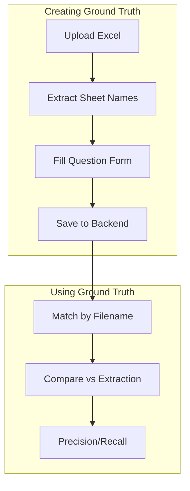
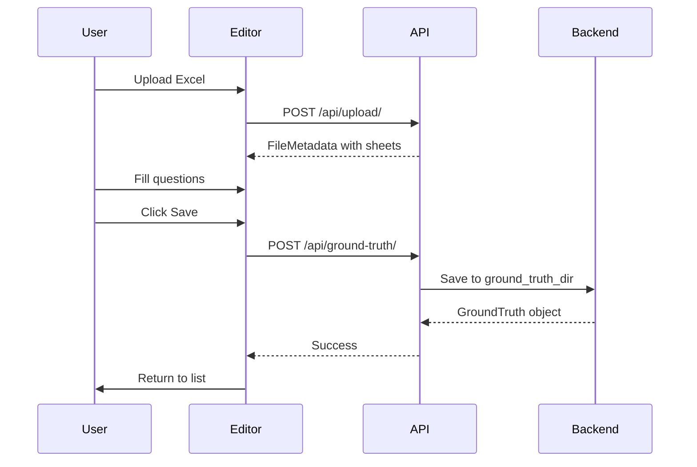
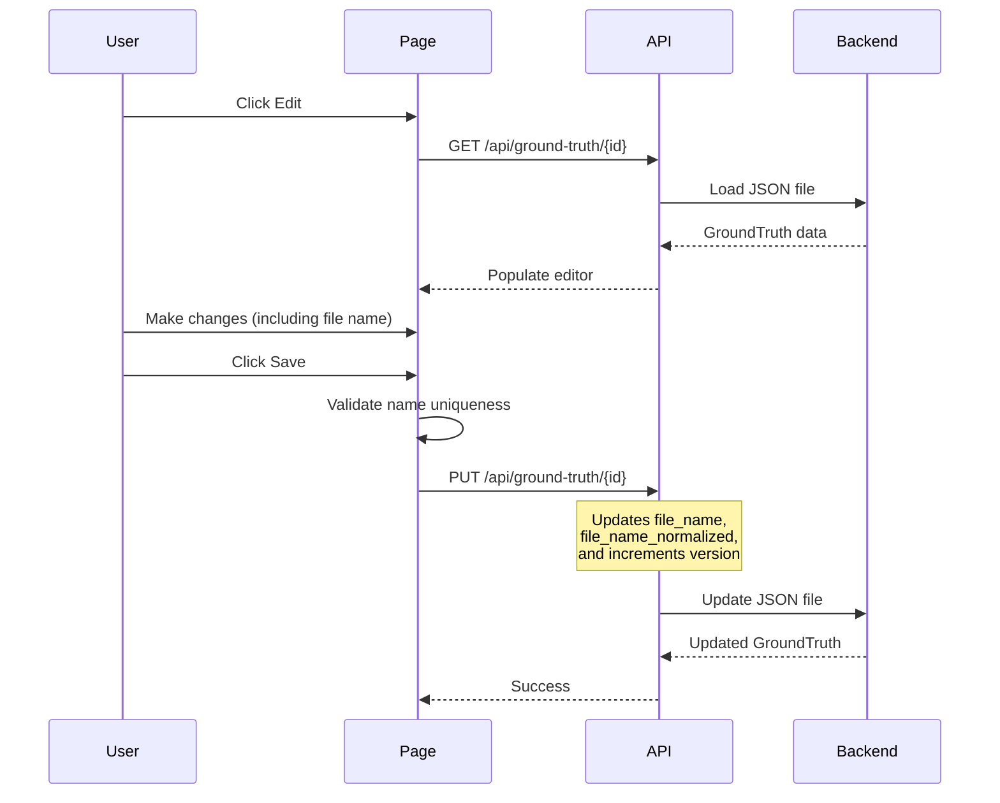
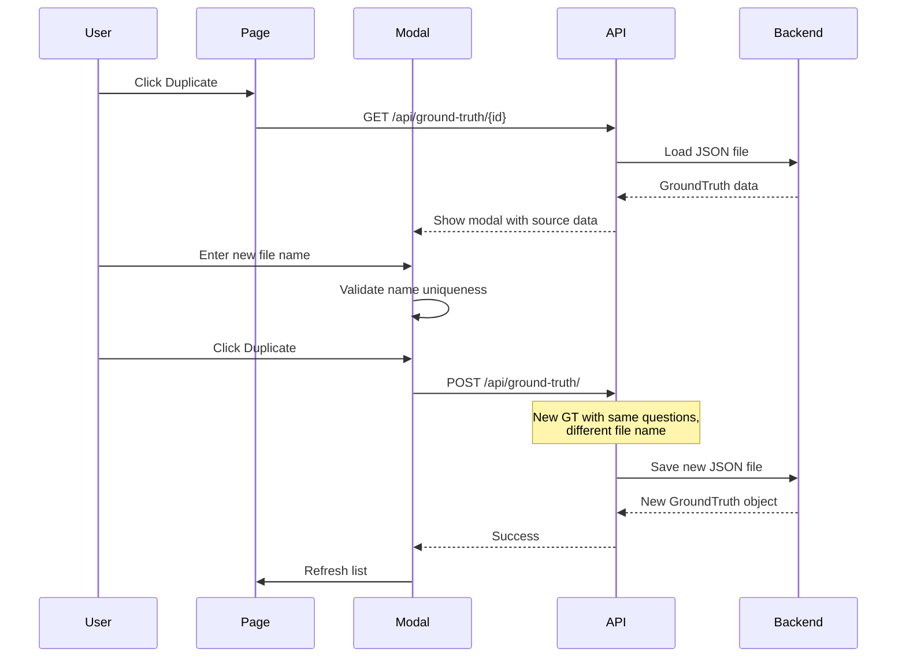

# Ground Truth Feature

The Ground Truth feature allows users to create and manage validated question sets ("golden data") for Excel files. These can be used to measure extraction accuracy against known-correct results.

## Overview



## Components

### GroundTruthPage (`GroundTruthPage.tsx`)

Main page component with two modes:

| Mode | Description |
|------|-------------|
| List View | Shows all existing ground truths in a table |
| Editor View | Create or edit a ground truth |

**Props:**
```typescript
interface GroundTruthPageProps {
  onBackToWizard: () => void;
}
```

**State:**
- `viewMode`: `'list' | 'create' | 'edit'`
- `editingId`: ID of ground truth being edited
- `fileMetadata`: Excel metadata for new entries
- `duplicateModalOpen`: Controls duplicate modal visibility
- `duplicatingId`: ID of ground truth being duplicated

**Actions:**
| Action | Description |
|--------|-------------|
| Create New | Start creating a new ground truth from scratch |
| Edit | Modify an existing ground truth (including file name) |
| **Duplicate** | Create a copy with a different name (all questions preserved) |
| Delete | Remove a ground truth permanently |

**File Name Collision Detection:**
- When creating or editing, the system validates that the file name is unique
- Case-insensitive comparison (e.g., "Survey.xlsx" = "survey.xlsx")
- When editing, the current ground truth's name is excluded from the collision check
- Clear error messages guide users to choose a different name if collision detected

---

### DuplicateModal (`GroundTruthPage.tsx`)

Modal dialog for duplicating ground truths with name validation.

**Features:**
- Shows source ground truth name and question count
- Validates new name is:
  - Not empty
  - Different from source name (case-insensitive)
  - Not already used by another ground truth (case-insensitive)
- Auto-appends duplication note to new ground truth
- Supports keyboard shortcuts (Enter to confirm, ESC handled by overlay click)

**Props:**
```typescript
interface DuplicateModalProps {
  sourceGroundTruth: GroundTruth;
  existingFileNames: string[];  // Lowercase normalized names
  onConfirm: () => void;
  onCancel: () => void;
}
```

**Validation Rules:**
- New name required (no empty strings)
- New name ≠ source name (case-insensitive comparison)
- New name must not exist in `existingFileNames` array
- Real-time validation feedback with error messages

---

### GroundTruthEditor (`GroundTruthEditor.tsx`)

Form for creating and editing ground truths.

**Props:**
```typescript
interface GroundTruthEditorProps {
  isEditing?: boolean;            // Whether editing an existing GT (vs. creating new)
  existingData?: GroundTruth;     // Pre-populate editor with this data (edit mode)
  fileMetadata?: FileMetadata;    // Sheet names from uploaded Excel (create mode)
  existingFileNames?: string[];   // Lowercase normalized names for collision detection
  onSave: () => void;
  onCancel: () => void;
}
```

**Features:**
- File upload to extract sheet names
- Manual filename entry option
- Sheet tabs with question counts
- Add/edit/remove sheets
- Add/edit/remove questions per sheet
- Question type selection
- Answer options for choice types
- Total question count summary (shown above sheets)
- **Bulk question upload**: Paste multiple questions separated by newlines
- **Reverse question IDs**: Reverse order of questions and renumber IDs
- **Mark as problematic**: Flag questions with optional comment
- **Auto-renumbering**: IDs renumber sequentially (Q001, Q002...) after add/remove

**Form Sections:**

1. **File Upload/Entry** (create mode only)
   - Drag-and-drop Excel upload
   - OR manual filename entry

2. **File Information**
   - **File name** (always editable with collision detection)
   - Created by (required)
   - Notes (optional)

3. **Sheets & Questions**
   - Tab per sheet
   - Editable sheet names
   - Question list with inline forms

**File Name Editing:**
- File names can be edited both when creating and editing ground truths
- Real-time validation prevents name collisions with other ground truths (case-insensitive)
- Changing the file name affects how the ground truth matches with extraction results
- The system shows a helpful hint when editing: "(editable)" label and warning about matching impact

---

## Data Flow

### Creating Ground Truth



### Editing Ground Truth



**Editable Fields:**
- File name (with collision detection)
- Created by
- Notes
- All sheets and questions
- Version is auto-incremented on save

### Duplicating Ground Truth



---

## API Endpoints

| Method | Endpoint | Description |
|--------|----------|-------------|
| POST | `/api/ground-truth/` | Create new ground truth |
| GET | `/api/ground-truth/` | List all (summaries) |
| GET | `/api/ground-truth/{id}` | Get full data |
| PUT | `/api/ground-truth/{id}` | Update existing |
| DELETE | `/api/ground-truth/{id}` | Delete |
| GET | `/api/ground-truth/by-filename/{name}` | Find by Excel filename |

---

## Data Types

### GroundTruthQuestion

```typescript
interface GroundTruthQuestion {
  id: string;                    // User-assigned (Q001, Q002...)
  question_text: string;
  question_type: QuestionType;
  answers?: string[];            // For choice types
  row_index?: number;            // Optional Excel row reference
  is_problematic?: boolean;      // Mark question as problematic
  problematic_comment?: string;  // Optional comment explaining issue
}
```

### GroundTruthSheet

```typescript
interface GroundTruthSheet {
  sheet_name: string;
  questions: GroundTruthQuestion[];
}
```

### GroundTruth

```typescript
interface GroundTruth {
  ground_truth_id: string;
  file_name: string;
  file_name_normalized: string;
  created_by: string;
  created_at: string;
  updated_at: string;
  version: number;
  notes?: string;
  sheets: GroundTruthSheet[];
  total_question_count: number;
}
```

### GroundTruthUpdate

Used when updating an existing ground truth (PUT endpoint). All fields are optional — only provided fields are applied.

```typescript
interface GroundTruthUpdate {
  file_name?: string;   // Updates file_name AND file_name_normalized
  created_by?: string;
  notes?: string;
  sheets?: GroundTruthSheet[];
}
```

When `file_name` is provided in an update:
- `file_name` is set to the new value
- `file_name_normalized` is re-computed as `file_name.lower()`
- `version` is auto-incremented

---

## Storage

Ground truths are stored as JSON files in:

```
output/ground_truth/{ground_truth_id}.json
```

Example filename: `gt_20260128_123456_a1b2c3d4.json`

### Auto-healing & Robust Matching

The backend implements two safety mechanisms for `file_name_normalized`:

1. **Auto-healing on load** — When a ground truth JSON is loaded (e.g., after manual edits), the backend checks if `file_name_normalized` matches `file_name.lower()`. If not, it corrects the value and re-saves the file.

2. **Robust filename matching** — When looking up a ground truth by filename (for comparison or display), the backend checks *both*:
   - The stored `file_name_normalized` field
   - A runtime-normalized `file_name.lower()` of the original `file_name`

   This ensures manually copied or edited JSON files are matched correctly even if `file_name_normalized` was set incorrectly (e.g., not lowercased).

### File Format

```json
{
  "ground_truth_id": "gt_20260128_123456_a1b2c3d4",
  "file_name": "Survey_2024.xlsx",
  "file_name_normalized": "survey_2024.xlsx",
  "created_by": "john.doe@company.com",
  "created_at": "2026-01-28T12:34:56.789000",
  "updated_at": "2026-01-28T12:34:56.789000",
  "version": 1,
  "notes": "Validated by QA team",
  "sheets": [
    {
      "sheet_name": "ESG DDQ",
      "questions": [
        {
          "id": "Q001",
          "question_text": "What is your company name?",
          "question_type": "open_ended",
          "answers": null,
          "row_index": 5
        }
      ]
    }
  ],
  "total_question_count": 126
}
```

---

## Usage Workflow

### Creating From Scratch

1. **Navigate** to Ground Truth page via nav bar
2. **Click "Create New"**
3. **Upload Excel** to auto-populate sheet names (or enter manually)
4. **Add Questions** per sheet with:
   - Question ID (auto-suggested)
   - Question text
   - Question type
   - Answer options (for choice types)
   - Row index (optional)
5. **Save** the ground truth
6. Later, **compare** extraction results against ground truth

### Duplicating Existing Ground Truth

1. **Navigate** to Ground Truth page via nav bar
2. **Click "Duplicate"** on an existing ground truth
3. **Enter a new distinct file name** in the modal
   - Name must be different from all existing ground truths (case-insensitive)
   - Validation prevents name collisions
4. **Click "Duplicate"** to create the copy
   - All questions, sheets, and structure are preserved
   - Notes field is updated to indicate the source
   - New ground truth ID is generated
5. **Edit** the duplicated ground truth to customize questions as needed
6. Use for variations of the same survey or A/B testing

**Use Cases for Duplication:**
- Create variations of the same survey for different regions
- Test different question phrasings while keeping structure
- Version ground truths before making significant changes
- Create test data sets based on production ground truths

---

## Comparison Integration

When ground truth exists for an Excel file, extraction results are automatically compared in the Results view.

### Comparison Metrics Grid

| Metric | Description | Color Coding |
|--------|-------------|--------------|
| **Count** | Number of questions extracted | Green if equals GT count |
| **Time** | Extraction duration | No color (not comparable) |
| **Text Match** | % of GT questions found in extraction | Green ≥90%, Orange 70-89%, Red <70% |
| **Type Match** | % of matched questions with correct type | Green ≥90%, Orange 70-89%, Red <70% |
| **Answer Match** | % of matched questions with correct answers | Green ≥90%, Orange 70-89%, Red <70% |
| **Overall** | Weighted accuracy score | Green ≥90%, Orange 70-89%, Red <70% |
| **Missed** | GT questions not extracted | Click to see row numbers |
| **Extra** | Extracted questions not in GT | Click to see row numbers |

**Overall Accuracy Formula:**
```
overall = (text_match × 0.5) + (type_match × 0.3) + (answer_match × 0.2)
```

### Missed/Extra Row Numbers

When you click on the Missed or Extra count (if > 0):
- Expands to show table row numbers (e.g., `#5`, `#12`, `#23`)
- Row numbers match the `#` column in the comparison table below
- Helps quickly identify which questions were missed or are extra

### Question Row Coloring

Colors are applied **per-cell** (per approach column), not to entire rows:

| Cell Color | Meaning |
|------------|---------|
| **Green border** | Perfect match - text, type, AND answers match GT |
| **Orange border** | Partial match - text matches, but type OR answers differ |
| **Red border** | Missing (GT question not extracted) or Extra (not in GT) |
| **No border** | No ground truth to compare against |

### Inline Difference Badges

Small badges appear in approach columns to show specific differences:

| Badge | Color | Meaning |
|-------|-------|---------|
| `TEXT` | Red | Question text differs from GT |
| `TYPE` | Orange | Question type doesn't match |
| `ANSWERS` | Orange | Answer options differ |
| `EXTRA` | Red | Question not in ground truth |

### Duplicate Detection

Duplicate questions in ground truth are highlighted:

- **Orange `DUP #X` badge**: Shows other row numbers with identical question text
- **Orange background**: Cells with duplicates have a light orange tint
- Example: Row 5 shows `DUP #12` if row 12 has the same question text

This helps identify intentional vs. accidental duplicates in your ground truth data.

### No Deduplication of Ground Truth

**Important**: The comparison table preserves ALL ground truth questions:
- If GT has 47 questions, the table shows 47 rows
- Even if some GT questions have identical text, each appears as a separate row
- This ensures ground truth is the authoritative reference ("etalon")

### Comparison Data Types

```typescript
interface DetailedMetrics {
  textMatchRate: number;      // GT questions found / total GT questions
  typeMatchRate: number;      // Correct types / matched questions
  answerMatchRate: number;    // Correct answers / questions with answers
  overallAccuracy: number;    // Weighted average
  matchedCount: number;       // Number of exact text matches
  missedRowNumbers: number[]; // Table row numbers of missed questions
  extraRowNumbers: number[];  // Table row numbers of extra questions
}
```

### Backend Comparison Endpoint

```typescript
POST /api/ground-truth/compare/{filename}

// Request body
{
  "results": Record<string, ExtractionResult>
}

// Response
Record<string, GroundTruthComparisonResult>
```

```typescript
interface GroundTruthComparisonResult {
  ground_truth_count: number;
  extracted_count: number;
  exact_matches: number;
  fuzzy_matches: number;
  missed_questions: number;
  extra_questions: number;
  precision: number;   // matches / extracted
  recall: number;      // matches / ground_truth
  f1_score: number;    // harmonic mean of precision & recall
  matched_questions: Array<{ gt_id: string; gt_text: string; extracted_text: string }>;
  missed_question_ids: string[];
}
