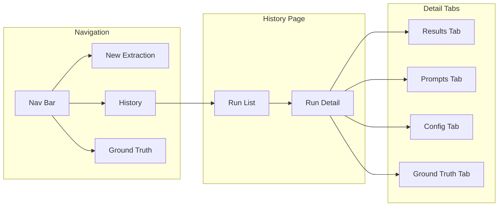
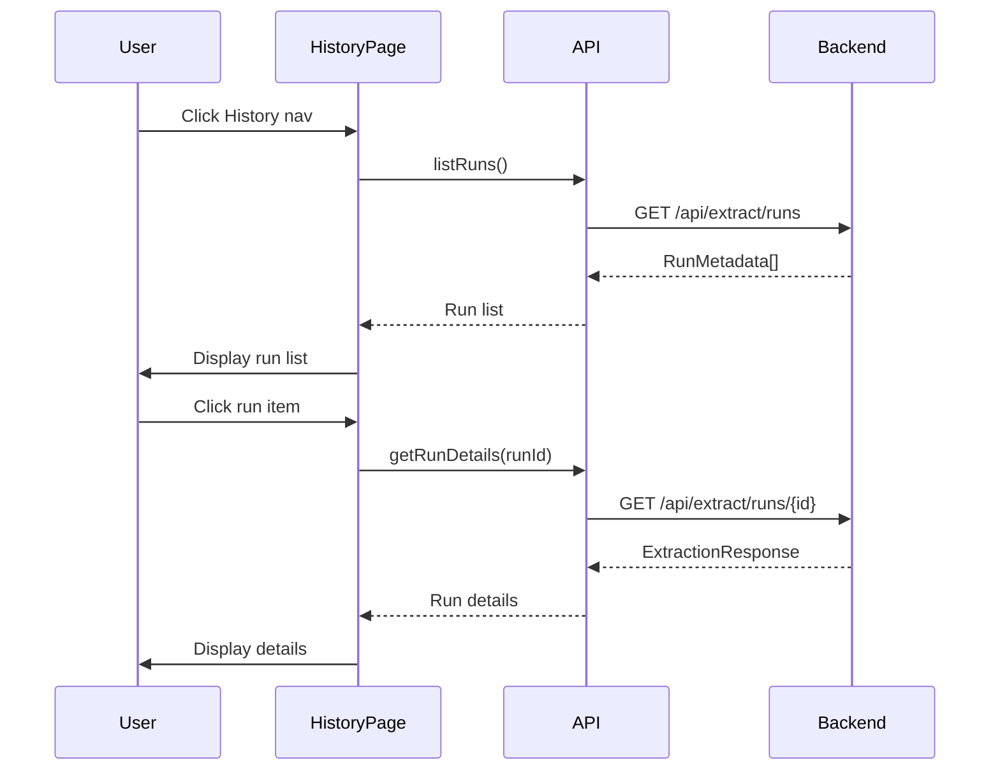

# History Feature

The History feature allows users to browse past extraction runs, view results, and review prompts.

## Overview



## Components

### HistoryPage (`HistoryPage.tsx`)

Main container with two-panel layout.

**Props:**
```typescript
interface HistoryPageProps {
  onBackToWizard: () => void;
}
```

**Layout:**
- Left panel: Run list (350px width)
- Right panel: Run details (remaining space)

---

## Run List Panel

Displays all historical runs sorted by date (newest first).

### Data Source

```typescript
const runsQuery = useQuery({
  queryKey: ['runs'],
  queryFn: listRuns,
});
```

**API:** `GET /api/extract/runs`

### Run List Item

Each item displays:

| Field | Source | Description |
|-------|--------|-------------|
| **File Name** | `file_name` | Original Excel filename (primary identifier) |
| Run ID | `run_id.slice(-12)` | Last 12 chars of ID |
| Date | `timestamp` | Formatted date |
| Time | `timestamp` | Formatted time |
| Approaches | `approaches_run` | e.g., "A1, A2, A3" |
| Model | `config.model` | Selected model |
| Compare flag | `config.compare_models` | "(model comparison)" |

The filename is displayed prominently at the top of each list item for easy identification.

### Selection State

```typescript
const [selectedRunId, setSelectedRunId] = useState<string | null>(null);
```

Clicking a run item sets `selectedRunId` and triggers detail fetch.

---

## Run Detail Panel

Displays details for the selected run.

### Data Source

```typescript
const runDetailQuery = useQuery({
  queryKey: ['run', selectedRunId],
  queryFn: () => getRunDetails(selectedRunId!),
  enabled: !!selectedRunId,
});
```

**API:** `GET /api/extract/runs/{run_id}`

### Tab Navigation

Four tabs (Ground Truth tab only appears when ground truth exists for the file):

1. **Results** - Metrics and sample questions
2. **Prompts** - Full prompts for each approach
3. **Configuration** - Run settings and column mappings
4. **Ground Truth** - Comparison against validated questions (conditional)

---

## Results Tab

### Metrics Grid

Side-by-side comparison of all approaches:

| Metric | Description |
|--------|-------------|
| Status | Success/Failed |
| Question Count | `metrics.extraction_count` |
| Time | `metrics.total_time_ms` formatted |
| Accuracy | `metrics.accuracy` as percentage |
| Avg Confidence | `metrics.avg_confidence` as percentage |

### Sample Questions

Shows first 5 questions from each approach:
- Question type badge
- Question text (truncated to 150 chars)

---

## Prompts Tab

View and copy the full prompt used for each approach.

### Prompt Selector

```typescript
const [selectedPrompt, setSelectedPrompt] = useState<string>(approachKeys[0]);
```

Dropdown to select approach (e.g., "Approach 1 (opus-4.5)").

### Prompt Display

- Header with approach name and copy button
- Monospace font in scrollable container
- Copy to clipboard functionality

```typescript
navigator.clipboard.writeText(results[selectedPrompt].prompt!);
```

---

## Config Tab

Displays the configuration used for the run.

### General Settings

| Field | Source |
|-------|--------|
| Run ID | `metadata.run_id` |
| File ID | `metadata.file_id` |
| Timestamp | `metadata.timestamp` formatted |
| Model | `metadata.config.model` |
| Compare Models | `metadata.config.compare_models` |
| Run All | `metadata.config.run_all_approaches` |

### Column Mappings

For each mapping in `metadata.config.column_mappings`:
- Sheet name
- Question column
- Answer column (if set)
- Start row
- End row (if set)

---

## Ground Truth Tab

Displayed only when a ground truth exists for the file (matched by filename).

### Data Source

```typescript
const groundTruthQuery = useQuery({
  queryKey: ['groundTruthComparison', fileName, runId],
  queryFn: () => compareWithGroundTruth(fileName, data.results),
  enabled: !!fileName && Object.keys(data.results).length > 0,
});
```

**API:** `POST /api/ground-truth/compare/{filename}`

### Metrics Grid

Side-by-side comparison for each approach:

| Metric | Description |
|--------|-------------|
| Ground Truth | Total questions in ground truth |
| Extracted | Questions extracted by approach |
| Exact Matches | Questions matching exactly |
| Fuzzy Matches | Questions matching >80% similarity |
| Missed | Ground truth questions not found |
| Extra | Extracted questions not in ground truth |
| **Precision** | matches / extracted |
| **Recall** | matches / ground truth |
| **F1 Score** | Harmonic mean of precision & recall |

### Missed Questions

Lists question IDs from ground truth that were not found by each approach.

---

## Data Flow



---

## API Functions

From `frontend/src/api/client.ts`:

### listRuns()

```typescript
export async function listRuns(): Promise<RunMetadata[]> {
  const response = await api.get<RunMetadata[]>('/extract/runs');
  return response.data;
}
```

### getRunDetails()

```typescript
export async function getRunDetails(runId: string): Promise<ExtractionResponse> {
  const response = await api.get<ExtractionResponse>(`/extract/runs/${runId}`);
  return response.data;
}
```

---

## Types

### RunMetadata

```typescript
interface RunMetadata {
  run_id: string;
  file_name: string;
  file_id: string;
  timestamp: string;
  approaches_run: number[];
  config: ExtractionConfig;
}
```

### ExtractionResponse

```typescript
interface ExtractionResponse {
  run_id: string;
  results: Record<string, ExtractionResult>;
  comparison?: ComparisonResult;
}
```

---

## Helper Functions

### formatApproachKey()

Converts internal key to display label:

```typescript
function formatApproachKey(key: string, result?: ExtractionResult): string {
  // "approach_1_opus_4_5" → "Approach 1 (opus-4.5)"
}
```

**Examples:**
- `approach_1` → "Approach 1"
- `approach_2_opus_4_5` → "Approach 2 (opus-4.5)"
- `approach_3_sonnet_4` → "Approach 3 (sonnet-4)"

---

## State Management

State is managed within `HistoryPage` component:

| State | Type | Purpose |
|-------|------|---------|
| `selectedRunId` | `string \| null` | Currently selected run |
| `activeTab` | `'results' \| 'prompts' \| 'config' \| 'groundtruth'` | Active detail tab |
| `selectedPrompt` | `string` | Selected approach in Prompts tab |

React Query handles data fetching and caching:

| Query Key | Fetches |
|-----------|---------|
| `['runs']` | All run metadata |
| `['run', runId]` | Specific run details |

---

## Empty States

| Condition | Message |
|-----------|---------|
| No runs exist | "No extraction runs found. Run an extraction first!" |
| No run selected | "Select a run from the list to view details" |
| No prompt available | "No prompt available for this approach." |

---

## Styling

CSS classes in `index.css`:

| Class | Purpose |
|-------|---------|
| `.history-page` | Main container |
| `.history-layout` | Two-panel grid |
| `.run-list-panel` | Left panel |
| `.run-detail-panel` | Right panel |
| `.run-list-item` | Individual run entry |
| `.tabs` | Tab navigation |
| `.tab.active` | Selected tab |
| `.prompt-content` | Monospace prompt display |
