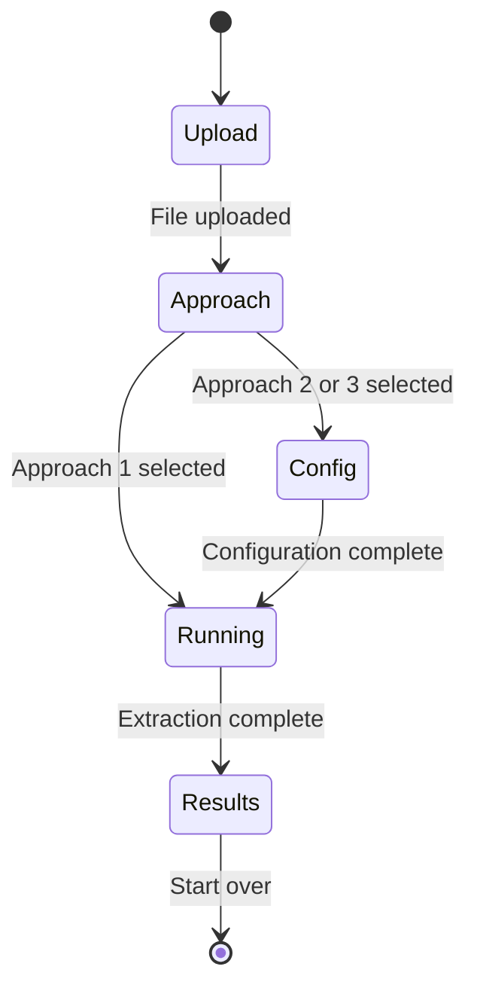
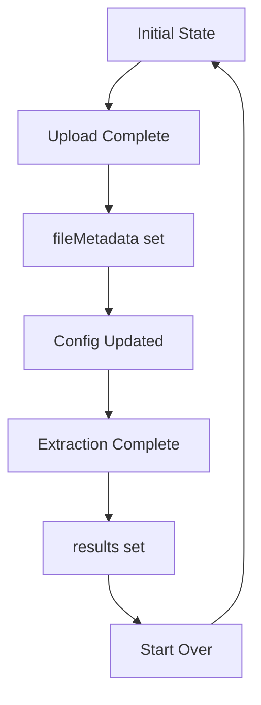

# Frontend Extraction Wizard

The extraction wizard guides users through uploading an Excel file, selecting an extraction approach, configuring options, and viewing results.

## Wizard Flow



## Steps

### 1. Upload Step (`UploadStep.tsx`)

**Purpose**: Accept Excel file from user.

**Behavior**:
- Drag-and-drop zone using `react-dropzone`
- Accepts `.xlsx` and `.xls` files
- Shows file preview with name and size
- Uploads to `POST /api/upload/`

**API Call**:
```typescript
uploadFile(file: File) → UploadResponse
```

**Output**: `FileMetadata` with sheets, columns, and sample data.

**Next Step**: Approach

---

### 2. Approach Step (`ApproachStep.tsx`)

**Purpose**: Select extraction method and model.

**Options**:
| Option | Description |
|--------|-------------|
| Approach 1 | Fully automatic - no config needed |
| Approach 2 | User-guided with column mappings |
| Approach 3 | Deterministic parsing + LLM judge |
| Model | Opus 4.5 (default) or Sonnet 4 |
| Compare Models | Run with both models side-by-side |
| Run All | Execute all 3 approaches |

**Conditional Navigation**:
- Approach 1 only → Skip to Running
- Approach 2, 3, or "Run All" → Go to Config

**Next Step**: Config or Running

---

### 3. Config Step (`ConfigStep.tsx`)

**Purpose**: Map columns for guided extraction.

**Sheet Selection**:
- Auto-includes sheets with >10 rows
- Toggle to include/exclude sheets

**Column Mapping** (per sheet):
| Field | Required | Description |
|-------|----------|-------------|
| Question Column | Yes | Column containing question text |
| Answer Column | No | Column with answer options |
| Start Row | Yes (default: 2) | First data row (skip headers) |

**Question Types** (Approach 2 only):
- `open_ended`
- `single_choice`
- `multiple_choice`
- `grouped_question`
- `yes_no`

**Validation**: At least one sheet must have a question column mapped.

**Next Step**: Running

---

### 4. Results Step (`ResultsStep.tsx`)

**Purpose**: Display extraction results and comparisons.

**Phases**:
1. **Running**: Shows loading spinner, triggers `POST /api/extract/`
2. **Results**: Displays extracted questions and metrics

**API Calls**:
```typescript
runExtraction(fileId: string, config: ExtractionConfig) → ExtractionResponse
getGroundTruthByFilename(fileName: string) → GroundTruth | null
compareWithGroundTruth(fileName: string, results) → Record<string, GroundTruthComparisonResult>
```

**View Modes**:

| Mode | Description |
|------|-------------|
| Individual | View one approach at a time |
| Comparison | Side-by-side grid of all approaches + ground truth |

The comparison view is shown automatically when:
- Multiple approaches are run, OR
- A ground truth exists for the uploaded file

**Metrics Displayed** (basic):
- Question count
- Extraction time (ms)
- Average confidence (Approach 3)
- Low confidence count

**Ground Truth Metrics** (when available):
- Ground truth shown as first column in comparison
- **Count**: Green if matches GT count exactly
- **Time**: No color (not comparable to GT)
- **Text Match**: % of GT questions found (green ≥90%, orange 70-89%, red <70%)
- **Type Match**: % of matched questions with correct type
- **Answer Match**: % of matched questions with correct answers
- **Overall**: Weighted accuracy (50% text, 30% type, 20% answers)

**Question Row Coloring** (per-cell, against GT):
- **Green border**: Perfect match (text, type, and answers)
- **Orange border**: Partial match (text matches, type or answers differ)
- **Red border**: Missing from GT or Extra (not in GT)

**Comparison Winners** (when multiple approaches):
- Most questions extracted
- Fastest extraction
- Highest accuracy
- Highest average confidence

**Question Details**:
- Question text
- Question type
- Answer options (if present)
- Confidence bar (Approach 3)
- Unique/different highlighting in comparison mode
- Ground truth match indicator (✓ or ✗)

---

## State Management

State is managed in `App.tsx` using `WizardState`:

```typescript
interface WizardState {
  step: WizardStep;
  fileMetadata?: FileMetadata;
  config: ExtractionConfig;
  results?: ExtractionResponse;
  error?: string;
}
```

### State Flow



## API Client Functions

Located in `frontend/src/api/client.ts`:

| Function | Endpoint | Used In |
|----------|----------|---------|
| `uploadFile()` | POST /api/upload/ | UploadStep |
| `getFileMetadata()` | GET /api/upload/{id} | - |
| `runExtraction()` | POST /api/extract/ | ResultsStep |
| `listRuns()` | GET /api/extract/runs | HistoryPage |
| `getRunDetails()` | GET /api/extract/runs/{id} | HistoryPage |
| `getGroundTruthByFilename()` | GET /api/ground-truth/by-filename/{name} | ResultsStep |
| `compareWithGroundTruth()` | POST /api/ground-truth/compare/{filename} | ResultsStep, HistoryPage |

## Sheet Handling

1. **File Upload**: Backend parses Excel, returns sheet metadata
2. **Config Step**: User selects sheets and maps columns
3. **Extraction**: Backend uses mappings to guide extraction


### Column Mapping Structure

```typescript
interface ColumnMapping {
  sheet_name: string;
  question_column: string;      // Required
  answer_column?: string;       // Optional
  type_column?: string;         // Optional
  question_types: QuestionType[];
  start_row: number;            // Default: 2
  end_row?: number;             // Optional
}
```

## Error Handling

- Errors display in red banner at top of wizard
- Network errors show specific message
- Extraction failures show per-approach error in results
- "Start Over" resets all state including errors
